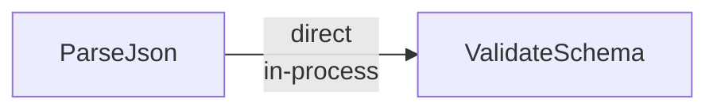
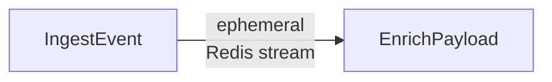
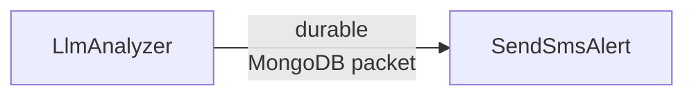
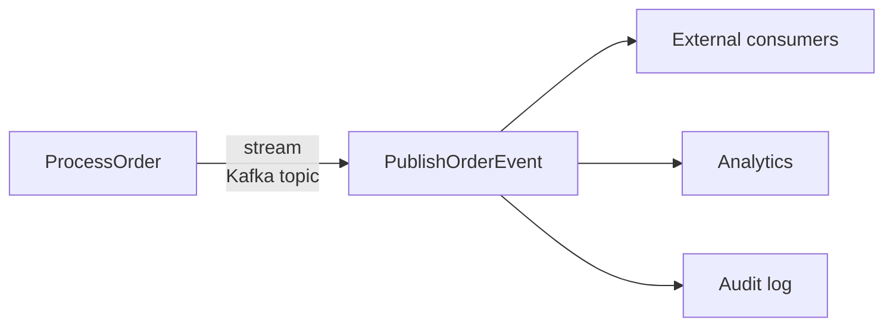

Delivery modes are the most important concept in FlowDSL. Every edge in a flow declares a delivery mode that determines how packets travel from the source node to the destination node — including durability guarantees, transport infrastructure, replay behavior, and latency characteristics.

The runtime enforces these guarantees. You declare the mode; the runtime handles the implementation.

## The five modes

### `direct`

**In-process, synchronous delivery with zero durability.**

The source node's output is passed directly to the destination node in the same process, with no intermediate storage. If the process crashes between the two nodes, the packet is lost. There is no queue, no retry, and no replay.

**When to use it:** Cheap, deterministic transformations where speed matters more than durability. Validation steps, format conversions, field extractions, in-memory aggregations.

**Guarantees:**

| Property | Value |
|----------|-------|
| Durability | None |
| Replay | No |
| Restart-safe | No |
| Latency | Microseconds |

```yaml
edges:
  - from: ParseJson
    to: ValidateSchema
    delivery:
      mode: direct
      packet: RawPayload
```



**Real-world example:** A high-throughput log ingestion pipeline where each event is parsed and field-extracted before being passed to the next stage. Parsing is cheap and deterministic — losing an event in a crash is acceptable because the source will resend.

---

### `ephemeral`

**Redis / NATS / RabbitMQ queue with low durability and built-in worker pool smoothing.**

Packets are written to a Redis stream, NATS queue, or RabbitMQ queue. Worker processes consume at their own pace, providing natural backpressure and burst absorption. If the broker restarts without persistence, unconsumed messages are lost. There is no replay after consumption.

**When to use it:** Medium-throughput steps that benefit from decoupling producer and consumer rates. Steps with variable processing time where you want to absorb traffic spikes without back-pressuring the upstream node.

**Guarantees:**

| Property | Value |
|----------|-------|
| Durability | Low (Redis AOF optional) |
| Replay | No (after consumption) |
| Restart-safe | Partial (depends on Redis persistence config) |
| Latency | Milliseconds |

```yaml
edges:
  - from: IngestEvent
    to: EnrichPayload
    delivery:
      mode: ephemeral
      packet: RawEvent
      stream: enrich-queue
      maxLen: 100000
```



**Real-world example:** A webhook receiver that ingests events from multiple sources at unpredictable rates and feeds a normalizer node. The Redis stream absorbs traffic spikes and allows the normalizer pool to drain at a steady pace.

---

### `checkpoint`

**Mongo / Redis / Postgres backed pipeline state with stage-level durability and resume support.**

After each node in a `checkpoint` chain completes, the runtime saves the output packet to the configured store (MongoDB, Redis, or Postgres). If a node or the runtime process fails, the pipeline can resume from the last successful checkpoint rather than restarting from the beginning. This is ideal for long multi-stage pipelines where reprocessing from the source is expensive.

**When to use it:** Long ETL pipelines, multi-stage data processing, document transformation pipelines where each step is expensive and restarting from scratch is unacceptable.

**Guarantees:**

| Property | Value |
|----------|-------|
| Durability | Stage-level (last completed stage is persisted) |
| Replay | Yes (from last checkpoint) |
| Restart-safe | Yes |
| Latency | Low to medium (MongoDB write per stage) |

```yaml
edges:
  - from: ExtractText
    to: ChunkDocument
    delivery:
      mode: checkpoint
      packet: ExtractedText
      checkpointInterval: 1
  - from: ChunkDocument
    to: EmbedChunks
    delivery:
      mode: checkpoint
      packet: DocumentChunks
```


**Real-world example:** A document intelligence pipeline that extracts text from PDFs, chunks it, embeds each chunk, and passes it to an LLM summarizer. Each stage is expensive. If the embedding step fails mid-way, the pipeline resumes from the last saved chunk batch rather than re-extracting and re-chunking.

---

### `durable`

**Mongo / Postgres backed packet-level durability with guaranteed delivery and idempotency support.**

Every packet is persisted to the configured store (MongoDB or Postgres) before delivery to the consumer. The consumer explicitly acknowledges receipt. If the consumer crashes before acknowledging, the packet is redelivered. This is the strongest delivery guarantee available short of `stream`. Combined with `idempotencyKey`, it provides exactly-once processing semantics.

**When to use it:** Business-critical transitions where data loss is unacceptable — payments, SMS/email sends, external API calls, LLM invocations, support ticket creation.

**Guarantees:**

| Property | Value |
|----------|-------|
| Durability | Packet-level (every packet persisted before delivery) |
| Replay | Yes (until acknowledged) |
| Restart-safe | Yes |
| Latency | Low (MongoDB write, typically <5ms) |

```yaml
edges:
  - from: LlmAnalyzer
    to: SendSmsAlert
    delivery:
      mode: durable
      packet: AlertPayload
      retryPolicy:
        maxAttempts: 3
        backoff: exponential
        initialDelay: PT2S
        maxDelay: PT30S
      idempotencyKey: "{{payload.alertId}}-sms"
```



**Real-world example:** An email triage flow where the urgency classification result triggers an SMS alert to an on-call engineer. The SMS send must not be duplicated if the node retries, and must not be lost if the process crashes. `durable` with `idempotencyKey` guarantees exactly-once delivery.

---

### `stream`

**Kafka / Redis / NATS durable event stream with fan-out and external consumer support.**

Packets are published to a streaming backend (Kafka topic, Redis stream, or NATS JetStream). Multiple independent consumers can read from the same topic — internal FlowDSL nodes, external services, analytics systems, or audit logs. Messages are retained for a configurable period regardless of consumer state. This is the integration mode for connecting FlowDSL to the broader event-driven ecosystem.

**When to use it:** External integration, event sourcing, fan-out to multiple consumers, audit trails, cross-team event contracts.

**Guarantees:**

| Property | Value |
|----------|-------|
| Durability | Durable stream (Kafka retention policy) |
| Replay | Yes (by offset reset) |
| Restart-safe | Yes |
| Latency | Low to medium (Kafka write, typically 5-20ms) |

```yaml
edges:
  - from: ProcessOrder
    to: PublishOrderEvent
    delivery:
      mode: stream
      packet: OrderProcessed
      topic: orders.processed
      consumerGroup: fulfillment-workers
```



**Real-world example:** An order processing flow that publishes a processed order event to a Kafka topic. The fulfillment service, the analytics pipeline, and the audit log all consume from the same topic independently. Adding a new consumer requires no changes to the FlowDSL document.

---

## Comparison table

| Mode | Transport | Durability | Replay | Restart-safe | Latency | Best for |
|------|-----------|-----------|-------|-------------|---------|---------|
| `direct` | In-process | None | No | No | Microseconds | Cheap transforms, same-process steps |
| `ephemeral` | Redis / NATS / RabbitMQ | Low | No | Partial | Milliseconds | Burst smoothing, worker pools |
| `checkpoint` | Mongo / Redis / Postgres | Stage-level | Yes | Yes | Low–medium | Long multi-stage ETL pipelines |
| `durable` | Mongo / Postgres | Packet-level | Yes | Yes | Low | Business-critical, LLM calls, payments |
| `stream` | Kafka / Redis / NATS | Durable stream | Yes | Yes | Low–medium | External integration, fan-out, sourcing |

## Choosing a mode

Not sure which mode to use? See [How to choose the right delivery mode](/docs/guides/choosing-delivery-modes) for a decision tree that walks through the key questions.

The short version: **when in doubt, use `durable`**. It has strong guarantees and reasonable performance. You can optimize to `direct` or `ephemeral` once you have real performance data.

## Next steps

- [Edges](/docs/concepts/edges) — how to declare edges with delivery policies
- [Retry Policies](/docs/concepts/retry-policies) — retrying failed deliveries
- [Choosing Delivery Modes](/docs/guides/choosing-delivery-modes) — practical decision guide
