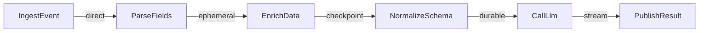

An edge connects the output of one node to the input of another and declares the delivery policy that governs that connection. The delivery policy specifies the transport mode, the packet type, retry behavior, and idempotency semantics. The runtime reads the edge and establishes the corresponding infrastructure connection — a Redis stream, a MongoDB collection, or a Kafka topic — according to the declared mode.

## Edge structure

```yaml
edges:
  - from: SourceNode           # "NodeName" or "NodeName.outputPort"
    to: DestinationNode        # "NodeName" or "NodeName.inputPort"
    delivery:
      mode: durable       # The delivery mode (required)
      packet: MyPacket         # Packet type reference (optional)
      retryPolicy:             # Retry behavior (optional)
        maxAttempts: 3
        backoff: exponential
        initialDelay: PT2S
      idempotencyKey: "{{payload.id}}-action"  # Deduplication key (optional)
```

### Fields

| Field | Type | Required | Description |
|-------|------|----------|-------------|
| `from` | string | Yes | Source: `"NodeName"` or `"NodeName.outputPort"` |
| `to` | string | Yes | Destination: `"NodeName"` or `"NodeName.inputPort"` |
| `delivery` | object | Yes | The delivery policy object |
| `when` | string | No | Condition expression for conditional edges |

## Simple edges

A simple edge connects any output of the source to any input of the destination:

```yaml
edges:
  - from: ParseJson
    to: ValidateFields
    delivery:
      mode: direct
      packet: RawPayload
```

When a node has a single input port and a single output port, omitting port names is idiomatic.

## Named port edges

When a node has multiple outputs (like a router), edges must specify which output port to draw from:

```yaml
nodes:
  RouteByPriority:
    operationId: route_by_priority
    kind: router
    outputs:
      urgent: { packet: EventPayload }
      normal: { packet: EventPayload }

edges:
  - from: RouteByPriority.urgent
    to: UrgentHandler
    delivery:
      mode: durable
      packet: EventPayload

  - from: RouteByPriority.normal
    to: NormalHandler
    delivery:
      mode: ephemeral
      packet: EventPayload
```

The `.` syntax addresses a specific port: `NodeName.portName`.

## Conditional edges

A `when` field adds a condition that the runtime evaluates against the packet before delivery. If the condition is false, the packet is not delivered on that edge:

```yaml
edges:
  - from: ScoreLead
    to: AssignToSalesRep
    when: "payload.score >= 80"
    delivery:
      mode: durable
      packet: ScoredLead

  - from: ScoreLead
    to: AddToNurture
    when: "payload.score >= 40 && payload.score < 80"
    delivery:
      mode: durable
      packet: ScoredLead

  - from: ScoreLead
    to: ArchiveLead
    when: "payload.score < 40"
    delivery:
      mode: direct
      packet: ScoredLead
```

::callout{type="info"}
Conditional edges are evaluated by the runtime against the packet payload. The expression syntax is a simple JSONPath-style predicate. Use a `router` node instead for complex routing logic that requires code.
::

## Edges with retry policies

```yaml
edges:
  - from: LlmAnalyzer
    to: CreateTicket
    delivery:
      mode: durable
      packet: AnalysisResult
      retryPolicy:
        maxAttempts: 5
        backoff: exponential
        initialDelay: PT1S
        maxDelay: PT60S
        jitter: true
```

If `CreateTicket` throws an error, the runtime waits `initialDelay` before retrying, doubling each time up to `maxDelay`. After `maxAttempts` failures, the packet is moved to the dead letter queue.

## Idempotency on edges

The `idempotencyKey` field on a delivery policy prevents duplicate processing when the runtime retries delivery after a crash between node execution and acknowledgment:

```yaml
edges:
  - from: ChargePayment
    to: SendConfirmation
    delivery:
      mode: durable
      packet: PaymentResult
      idempotencyKey: "{{payload.orderId}}-confirm-email"
```

The runtime uses this key to deduplicate — if a packet with the same key is already acknowledged, the duplicate is silently dropped. The key template uses `{{payload.field}}` syntax and should be globally unique for the intended logical operation.

## Different delivery modes per edge

It is common and encouraged to use different delivery modes on different edges within the same flow, matching the mode to the requirements of each step:



```yaml
edges:
  - from: IngestEvent
    to: ParseFields
    delivery: { mode: direct, packet: RawEvent }

  - from: ParseFields
    to: EnrichData
    delivery: { mode: ephemeral, packet: ParsedEvent, stream: enrich-q }

  - from: EnrichData
    to: NormalizeSchema
    delivery: { mode: checkpoint, packet: EnrichedEvent }

  - from: NormalizeSchema
    to: CallLlm
    delivery:
      mode: durable
      packet: NormalizedEvent
      idempotencyKey: "{{payload.eventId}}-llm"

  - from: CallLlm
    to: PublishResult
    delivery: { mode: stream, packet: LlmResult, topic: results.processed }
```

## What happens when an edge fails

1. **Retry** — if a retry policy is configured, the runtime retries according to the backoff schedule.
2. **Dead letter** — after all retry attempts are exhausted, the packet is moved to a dead letter collection in MongoDB (for `durable`) or logged (for `direct`/`ephemeral`).
3. **Alert** — the runtime emits a metric and optionally triggers a dead letter alert if configured.

Packets in the dead letter queue can be inspected, corrected, and re-injected via the runtime API.

## Summary

- Every edge has a `from`, `to`, and `delivery` policy.
- Named port syntax (`NodeName.portName`) addresses specific router outputs.
- `when` conditions enable content-based routing without a dedicated router node.
- `idempotencyKey` prevents duplicate processing on retry.
- Different edges in the same flow should use different modes appropriate to each step.

## Next steps

- [Delivery Modes](/docs/concepts/delivery-modes) — the five modes explained in full
- [Retry Policies](/docs/concepts/retry-policies) — configuring retry behavior
- [Idempotency](/docs/guides/idempotency) — writing safe idempotent nodes
