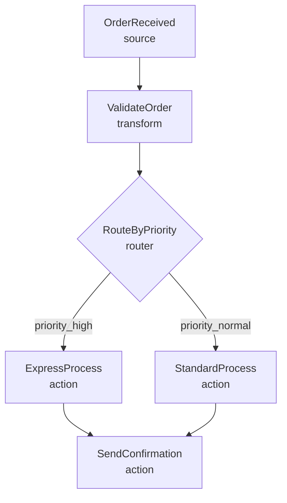
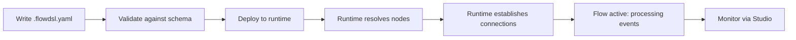

A FlowDSL flow is a **directed acyclic graph (DAG)** of nodes connected by edges. Each node performs a discrete unit of business logic. Each edge carries packets from one node to the next, governed by a delivery policy. The flow document is the authoritative description of this graph — the runtime reads it and handles all transport wiring.

## Top-level document structure

```yaml
flowdsl: "1.0"           # Spec version (required)
info:                     # Document metadata (required)
  title: Order Fulfillment
  version: "2.1.0"
  description: Processes orders from receipt to confirmation

externalDocs:             # Optional links to AsyncAPI / OpenAPI docs
  url: https://api.mycompany.com/asyncapi.yaml
  description: AsyncAPI event contracts

asyncapi: "./events.asyncapi.yaml"   # Optional: path to AsyncAPI doc

nodes:                    # Map of NodeName → Node definition (required)
  OrderReceived: ...
  ValidateOrder: ...

edges:                    # Array of edge definitions (required)
  - from: OrderReceived
    to: ValidateOrder
    delivery:
      mode: direct

components:               # Reusable definitions (optional)
  packets: ...
  policies: ...
```

### Top-level fields

| Field | Type | Required | Description |
|-------|------|----------|-------------|
| `flowdsl` | string | Yes | Spec version. Currently `"1.0"`. |
| `info` | object | Yes | Title, version, description, contact, license. |
| `externalDocs` | object | No | URL to external documentation (AsyncAPI, OpenAPI). |
| `asyncapi` | string | No | Path or URL to an AsyncAPI document for message references. |
| `openapi` | string | No | Path or URL to an OpenAPI document. |
| `nodes` | object | Yes | Map of PascalCase node name → Node object. |
| `edges` | array | Yes | Array of Edge objects. |
| `components` | object | No | Shared packets, policies, and node templates. |

## Flow topology

A flow can have:
- **Multiple entry points** — source nodes that have no incoming edges. Each source node is an independent entry point that triggers when its input event arrives.
- **Multiple terminal nodes** — nodes with no outgoing edges. A flow completes when all active paths reach a terminal node.
- **Branching** — a router node with multiple named outputs sends packets down different paths based on content.
- **Merging** — a node can receive inputs from multiple edges (uncommon; the runtime processes them independently).



## Flow lifecycle



1. **Write** — author the flow in YAML or JSON.
2. **Validate** — run `flowdsl validate my-flow.flowdsl.yaml` or use Studio's Validate button. The runtime rejects invalid documents at startup.
3. **Deploy** — load the document into the runtime (file path, S3 URL, or API).
4. **Resolve** — the runtime contacts each node's address (from the node registry or `node-registry.yaml`) and verifies it is available.
5. **Connect** — the runtime establishes delivery connections for each edge (Redis streams, MongoDB collections, Kafka topics) according to the declared delivery modes.
6. **Active** — the flow processes events. Each event that arrives at a source node is a fresh execution context.

## Naming conventions

| Element | Convention | Example |
|---------|-----------|---------|
| Flow ID | `snake_case` | `order_fulfillment_v2` |
| Node names | `PascalCase` | `OrderReceived`, `ValidatePayment` |
| `operationId` | `snake_case` | `validate_payment_amount` |
| Component names | `PascalCase` | `OrderPayload`, `PaymentResult` |

## A complete flow example

```yaml
flowdsl: "1.0"
info:
  title: Order Fulfillment
  version: "1.0.0"
  description: End-to-end order processing from receipt to customer confirmation

nodes:
  OrderReceived:
    operationId: receive_order
    kind: source
    summary: Entry point — receives new order events from the API gateway
    outputs:
      out:
        packet: OrderPayload

  ValidateOrder:
    operationId: validate_order
    kind: transform
    summary: Validates order fields and computes totals
    inputs:
      in:
        packet: OrderPayload
    outputs:
      out:
        packet: ValidatedOrder

  ChargePayment:
    operationId: charge_payment
    kind: action
    summary: Charges the payment method via Stripe
    inputs:
      in:
        packet: ValidatedOrder
    outputs:
      out:
        packet: PaymentResult

  SendConfirmation:
    operationId: send_confirmation_email
    kind: action
    summary: Sends order confirmation email to customer
    inputs:
      in:
        packet: PaymentResult

edges:
  - from: OrderReceived
    to: ValidateOrder
    delivery:
      mode: direct
      packet: OrderPayload

  - from: ValidateOrder
    to: ChargePayment
    delivery:
      mode: durable
      packet: ValidatedOrder
      retryPolicy:
        maxAttempts: 3
        backoff: exponential
        initialDelay: PT2S

  - from: ChargePayment
    to: SendConfirmation
    delivery:
      mode: durable
      packet: PaymentResult
      idempotencyKey: "{{payload.orderId}}-confirm"

components:
  packets:
    OrderPayload:
      type: object
      properties:
        orderId: { type: string }
        customerId: { type: string }
        items: { type: array }
        total: { type: number }
      required: [orderId, customerId, items, total]

    ValidatedOrder:
      type: object
      properties:
        orderId: { type: string }
        customerId: { type: string }
        total: { type: number }
        tax: { type: number }
        currency: { type: string }
      required: [orderId, customerId, total, currency]

    PaymentResult:
      type: object
      properties:
        orderId: { type: string }
        chargeId: { type: string }
        amount: { type: number }
        status: { type: string, enum: [succeeded, failed] }
      required: [orderId, chargeId, status]
```

## Summary

- A flow is a DAG of nodes connected by edges, declared in a single YAML or JSON file.
- The file is the source of truth — the runtime is an implementation of what the file declares.
- Flows can have multiple entry points, branching, and multiple terminal paths.
- Node names are `PascalCase`; `operationId` values are `snake_case`.

## Next steps

- [Nodes](/docs/concepts/nodes) — the nine node kinds in detail
- [Edges](/docs/concepts/edges) — delivery policies and edge configuration
- [Your First Flow](/docs/tutorials/your-first-flow) — build a complete flow step by step
