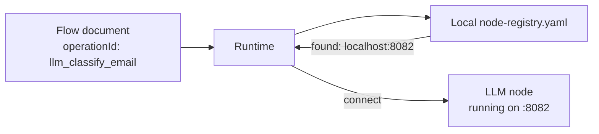

The node registry is where FlowDSL node implementations are published, versioned, and discovered. When the runtime loads a flow document, it looks up each node's `operationId` in the registry to find the implementation's network address and connect to it.

## How node resolution works



1. The runtime reads the flow document and collects all `operationId` values.
2. For each ID, it queries `node-registry.yaml` (local) or `repo.flowdsl.com` (remote).
3. The registry returns the node's address and version.
4. The runtime establishes a gRPC or HTTP connection to the node process.
5. When a packet arrives on an edge, the runtime calls the node's `Handle` method.

## node-registry.yaml

For local development, define a `node-registry.yaml` file in your project:

```yaml
nodes:
  receive_order:
    address: localhost:8080
    version: "1.0.0"
    runtime: go

  validate_order:
    address: localhost:8081
    version: "1.0.0"
    runtime: go

  llm_classify_email:
    address: localhost:8082
    version: "2.1.0"
    runtime: python

  send_sms_alert:
    address: localhost:8083
    version: "1.3.0"
    runtime: go

  charge_payment:
    address: payment-service.internal:9090
    version: "3.0.0"
    runtime: go
```

Set the registry file path via environment variable:

```bash
FLOWDSL_REGISTRY_FILE=./node-registry.yaml flowdsl-runtime start my-flow.flowdsl.yaml
```

## repo.flowdsl.com (coming soon)

The public node registry at `repo.flowdsl.com` will allow developers to publish and discover FlowDSL nodes. Published nodes are resolved by `operationId` and version. The runtime fetches the node's network endpoint from the registry automatically.

```bash
# Publishing a node (coming soon)
flowdsl publish --manifest flowdsl-node.json

# Specifying a registry in your flow
registry: https://repo.flowdsl.com
```

## The flowdsl-node.json manifest

Every node implementation ships a `flowdsl-node.json` manifest. This is the node's identity document — it describes the node's contract and metadata:

```json
{
  "operationId": "llm_classify_email",
  "name": "LLM Email Classifier",
  "version": "2.1.0",
  "description": "Classifies emails as urgent, normal, or spam using an LLM",
  "runtime": "python",
  "inputs": [
    {
      "name": "in",
      "packet": "EmailPayload",
      "description": "The email to classify"
    }
  ],
  "outputs": [
    {
      "name": "out",
      "packet": "ClassifiedEmail",
      "description": "Email with classification and confidence score"
    }
  ],
  "settings": {
    "type": "object",
    "properties": {
      "model": { "type": "string", "default": "gpt-4o-mini" },
      "temperature": { "type": "number", "default": 0.1 }
    }
  },
  "repository": "https://github.com/myorg/flowdsl-nodes",
  "author": "My Team",
  "license": "Apache-2.0",
  "tags": ["llm", "email", "classification"]
}
```

## Local vs remote nodes

| Mode | When to use | Address |
|------|-------------|---------|
| **Local** | Development, testing | `localhost:PORT` |
| **Docker** | Local multi-service setup | `node-name:PORT` (Docker network) |
| **Remote** | Production | `node-service.namespace.svc:PORT` |

The runtime doesn't care whether a node is local, in Docker, or across a network — it connects to whatever address the registry provides.

## Node versioning

The runtime can enforce version constraints:

```yaml
# node-registry.yaml
nodes:
  llm_classify_email:
    address: localhost:8082
    version: "2.1.0"
    minVersion: "2.0.0"   # Reject older versions
```

The node's `flowdsl-node.json` declares its own version, and the runtime rejects nodes that don't meet the minimum version constraint.

## Summary

- `node-registry.yaml` maps `operationId` to network addresses for local development.
- `repo.flowdsl.com` is the upcoming public registry for published nodes.
- Every node ships a `flowdsl-node.json` manifest describing its contract.
- The runtime connects to nodes at startup and calls them on packet arrival.

## Next steps

- [Write a Go Node](/docs/tutorials/writing-a-go-node) — implement a node and write its manifest
- [Node Manifest reference](/docs/reference/node-manifest) — full manifest field reference
- [Node Development](/docs/guides/node-development) — building and publishing nodes
