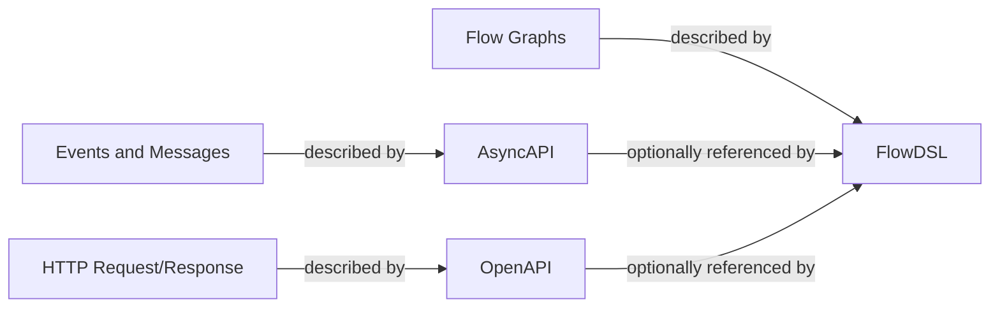
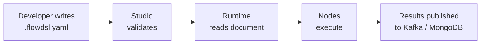

FlowDSL is an open specification for describing and executing event-driven flow graphs. A FlowDSL document is the single source of truth for how data moves through a system — which nodes process it, how it travels between them, and what delivery guarantees apply at each step. The runtime reads the document and enforces those guarantees; your application code never touches Kafka consumer groups or MongoDB retry logic directly.

## Where FlowDSL fits

There are three open specifications that together describe a modern event-driven system:



- **OpenAPI** describes the shape of HTTP APIs: paths, parameters, request/response schemas.
- **AsyncAPI** describes event and message contracts: topics, channels, message schemas.
- **FlowDSL** describes executable flow graphs: which nodes run, how they connect, and what delivery semantics apply to each connection.

FlowDSL is **fully self-contained**. You do not need an AsyncAPI or OpenAPI document to write a working FlowDSL flow. Packets and events are defined natively in the `components` section. AsyncAPI and OpenAPI are optional integrations — useful when you already have those contracts and want to reference them directly rather than duplicating schema definitions.

## The four layers

A FlowDSL system has four distinct layers, each with a clear responsibility:

| Layer | What it is | Who owns it |
|-------|-----------|-------------|
| **Contract** | The `.flowdsl.yaml` document | You (version-controlled in git) |
| **Flow Definition** | Nodes and edges declared in the document | You (declarative YAML/JSON) |
| **Runtime** | The process that reads the document and wires everything together | flowdsl-go or flowdsl-py runtime |
| **Storage** | MongoDB, Redis, Kafka — the backing stores for delivery modes | Your infrastructure |

Your job is to write the Contract. The Runtime's job is to implement everything the Contract declares.

## From definition to execution



1. You write a `.flowdsl.yaml` (or `.flowdsl.json`) file.
2. Studio (or the CLI) validates it against the JSON Schema at `https://flowdsl.com/schemas/v1/flowdsl.schema.json`.
3. The runtime reads the document, resolves node addresses, and establishes delivery connections.
4. When events arrive, nodes execute in the declared order.
5. Results are persisted or published according to the delivery mode on each edge.

## File formats

FlowDSL documents can be written in either format:

| Format | Extension | When to use |
|--------|-----------|-------------|
| YAML | `.flowdsl.yaml` | Human authoring, version control, code review |
| JSON | `.flowdsl.json` | Programmatic generation, API payloads, machine processing |

JSON is the canonical format that the runtime loads. The CLI converts YAML to JSON during the build step. Both formats are schema-validated identically.

## A minimal FlowDSL document

```yaml
flowdsl: "1.0"
info:
  title: User Signup Notification
  version: "1.0.0"
  description: Sends a welcome email when a user signs up

nodes:
  UserSignedUp:
    operationId: receive_signup
    kind: source
    summary: Receives new user signup events

  SendWelcomeEmail:
    operationId: send_welcome_email
    kind: action
    summary: Sends the welcome email via email provider

edges:
  - from: UserSignedUp
    to: SendWelcomeEmail
    delivery:
      mode: durable
      packet: SignupPayload

components:
  packets:
    SignupPayload:
      type: object
      properties:
        userId:
          type: string
        email:
          type: string
          format: email
        name:
          type: string
      required: [userId, email, name]
```

This is a complete, valid FlowDSL document. It declares two nodes, one edge between them using `durable` delivery (guaranteed, packet-level durability backed by MongoDB), and the packet schema for the data traveling along that edge.

## What FlowDSL is not

- **Not a workflow engine** — FlowDSL is a specification. The runtime is a separate implementation (flowdsl-go, flowdsl-py) that reads the spec. You can swap runtimes without changing your document.
- **Not an AsyncAPI extension** — FlowDSL is a peer specification, not a layer on top of AsyncAPI. AsyncAPI integration is optional.
- **Not a visual-first tool** — Studio is a convenience for visualizing and editing flows. The YAML file is always the source of truth.

## Summary

- FlowDSL is a specification (JSON Schema + rules), not a product.
- A FlowDSL document is a directed graph of nodes connected by edges with explicit delivery modes.
- The document is the source of truth; the runtime implements what it declares.
- FlowDSL is self-contained but can optionally reference AsyncAPI and OpenAPI schemas.

## Next steps

- [Flows](/docs/concepts/flows) — the structure of a FlowDSL document in detail
- [Nodes](/docs/concepts/nodes) — the nine node kinds and how to define them
- [Delivery Modes](/docs/concepts/delivery-modes) — the most important concept in the spec
