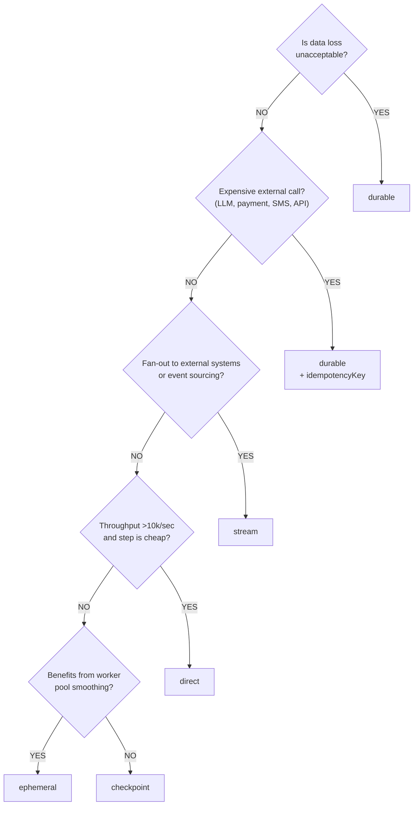

Every edge in a FlowDSL flow has a delivery mode. Choosing the wrong mode is either costly (unnecessary MongoDB writes for cheap transforms) or dangerous (using `direct` for a payment charge). This guide gives you a systematic way to make that decision.

## The decision tree



### The questions

**Q1: Is data loss unacceptable?**

If losing this packet would cause a business problem — a payment not charged, a support ticket not created, a notification not sent — the answer is yes.

→ **durable**

**Q2: Does this step involve an expensive external call?**

LLM invocations, payment charges, email/SMS sends, calls to third-party APIs with rate limits or per-call costs — these are expensive. Re-running them unnecessarily is costly or dangerous.

→ **durable + idempotencyKey**

The idempotency key is essential here because `durable` provides at-least-once delivery. Without it, a retry would call the LLM or send the SMS twice.

**Q3: Do you need fan-out to external systems?**

If multiple independent consumers need to react to this event — external services, analytics, audit logs, other teams' systems — publish to the event bus. Kafka's consumer group model handles independent consumption without flow changes.

→ **stream**

**Q4: Is throughput >10k/sec and the step cheap?**

High-volume, CPU-bound, deterministic steps (parsing, field extraction, format conversion) that run in microseconds and can be replayed from the source don't need a queue. In-process is fastest.

→ **direct**

**Q5: Benefits from worker pool smoothing?**

Medium-throughput steps with variable processing time benefit from a queue that decouples the producer and consumer rates. Redis streams provide this at low durability cost.

→ **ephemeral**

**Otherwise:** Long multi-stage pipelines where each step is expensive and you want resume-from-last-stage semantics.

→ **checkpoint**

## By workload class

### Stateful business workflow

Each event is a complete unit of work with multiple external interactions. Data loss is unacceptable throughout.

```yaml
# Email triage workflow — all durable
edges:
  - from: EmailFetcher
    to: LlmAnalyzer
    delivery:
      mode: durable
      idempotencyKey: "{{payload.messageId}}-analyze"

  - from: LlmAnalyzer
    to: RouteEmail
    delivery:
      mode: durable

  - from: RouteEmail.urgent
    to: SendSmsAlert
    delivery:
      mode: durable
      idempotencyKey: "{{payload.messageId}}-sms"
```

### High-throughput data pipeline

High-volume event processing where throughput matters, stages are progressively more expensive, and the first stages can be replayed cheaply from the source.

```yaml
# Telemetry pipeline — modes escalate in durability as value increases
edges:
  # Fast, cheap parse — in-process
  - from: IngestTelemetry
    to: ParseEvent
    delivery:
      mode: direct

  # Medium throughput enrichment — worker smoothing
  - from: ParseEvent
    to: EnrichWithMeta
    delivery:
      mode: ephemeral
      stream: telemetry-enrich

  # Expensive aggregation — stage-level resume
  - from: EnrichWithMeta
    to: AggregateMetrics
    delivery:
      mode: checkpoint
      batchSize: 100

  # LLM anomaly detection — expensive, must not duplicate
  - from: AggregateMetrics
    to: DetectAnomalies
    delivery:
      mode: durable
      idempotencyKey: "{{payload.windowId}}-anomaly"

  # Publish to downstream consumers
  - from: DetectAnomalies
    to: PublishAnomalyEvent
    delivery:
      mode: stream
      topic: telemetry.anomalies
```

## Mode comparison at a glance

| Scenario | Mode | Reason |
|----------|------|--------|
| JSON field extraction | `direct` | Cheap, in-process, deterministic |
| Log parsing at 100k/sec | `direct` | Throughput > durability |
| Burst absorption | `ephemeral` | Worker pool, variable rate |
| Long ETL pipeline | `checkpoint` | Stage-level resume |
| Payment charge | `durable` | Critical, must not lose |
| LLM call | `durable + idempotency` | Expensive, non-deterministic |
| Fanout to analytics | `stream` | Multiple independent consumers |
| Send SMS | `durable + idempotency` | Irreversible side effect |
| Archive spam | `direct` | Idempotent, cheap, fast |

## When in doubt

Use `durable`. It has strong guarantees and reasonable performance (typically <5ms overhead on MongoDB). You can always optimize to `direct` or `ephemeral` after you have real performance data. The cost of under-engineering delivery semantics is data loss; the cost of over-engineering is a few milliseconds of latency.

> **Default rule:** Start with `durable`. Add `idempotencyKey` whenever the node has side effects. Optimize later.

## Next steps

- [Delivery Modes](/docs/concepts/delivery-modes) — the full explanation of each mode
- [Idempotency](/docs/guides/idempotency) — implementing safe idempotent nodes
- [Stateful vs Streaming](/docs/guides/stateful-vs-streaming) — the two workload classes
