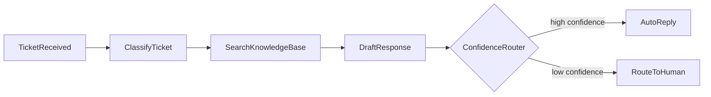

FlowDSL is exceptionally well-suited for orchestrating LLM workflows. The core challenge with LLM pipelines is that LLM calls are expensive, non-deterministic, and have side effects — exactly the conditions where FlowDSL's delivery semantics provide the most value.

## Why LLM steps need `durable`

An LLM call has three properties that make transport semantics critical:

1. **Expensive** — each call costs money. Re-running unnecessarily wastes budget.
2. **Non-deterministic** — calling the same prompt twice may return different results. Retry-on-failure could produce inconsistent pipeline state.
3. **Slow** — LLM calls take 0.5–10 seconds. A process crash during that window is common.

`durable` with `idempotencyKey` solves all three:

- The packet is persisted before delivery — if the process crashes during the LLM call, the packet survives and is redelivered to the same node.
- The idempotency key prevents the LLM from being called again if the packet is redelivered after the call already completed.
- The runtime acknowledges the packet only after the node handler returns successfully.

```yaml
edges:
  - from: PrepareContext
    to: LlmSummarize
    delivery:
      mode: durable
      packet: DocumentContext
      idempotencyKey: "{{payload.documentId}}-summarize-v1"
      retryPolicy:
        maxAttempts: 3
        backoff: exponential
        initialDelay: PT5S
        maxDelay: PT60S
        retryOn: [RATE_LIMITED, TIMEOUT]
```

## Why idempotency is critical for LLM nodes

Consider a document summarizer that:
1. Receives a document chunk
2. Calls GPT-4 to summarize it (takes 3 seconds)
3. Stores the result in the database
4. Acknowledges the packet

If the process crashes at step 3, the runtime will redeliver the packet. Without idempotency:
- The LLM is called again (costs money, may return different text)
- Two different summaries may be stored for the same chunk
- Downstream nodes receive inconsistent state

With `idempotencyKey: "{{payload.chunkId}}-summarize"`:
- The runtime checks if this key was already processed
- If yes, the stored result is returned without calling the LLM again
- Consistent, cost-efficient, deterministic

## Common LLM node types

### LlmAnalyzer

Classifies or analyzes input. Returns structured JSON output.

```yaml
LlmAnalyzer:
  operationId: llm_analyze_content
  kind: llm
  inputs:
    in: { packet: ContentPayload }
  outputs:
    out: { packet: AnalysisResult }
  settings:
    model: gpt-4o-mini
    temperature: 0.1
    responseFormat: json_object
    systemPrompt: |
      Analyze the content and return structured JSON with:
      classification, confidence (0-1), key_entities, sentiment
```

### LlmRouter

Classifies input and returns a routing decision. Use a `router` kind node that reads the LLM output.

```yaml
LlmClassifier:
  operationId: llm_classify_for_routing
  kind: llm
  settings:
    systemPrompt: "Return JSON: {\"route\": \"path_a|path_b|path_c\"}"

RouteOnClassification:
  operationId: route_on_llm_classification
  kind: router
  inputs:
    in: { packet: ClassificationResult }
  outputs:
    path_a: { packet: ClassificationResult }
    path_b: { packet: ClassificationResult }
    path_c: { packet: ClassificationResult }
```

### LlmSummarizer

Reduces a long document to a shorter summary.

```yaml
LlmSummarize:
  operationId: llm_summarize_document
  kind: llm
  inputs:
    in: { packet: DocumentChunks }
  outputs:
    out: { packet: DocumentSummary }
  settings:
    model: gpt-4o
    maxTokens: 500
    systemPrompt: "Summarize this document in 3-5 sentences. Focus on key findings."
```

### LlmExtractor

Extracts structured data from unstructured text.

```yaml
LlmExtract:
  operationId: llm_extract_entities
  kind: llm
  inputs:
    in: { packet: RawText }
  outputs:
    out: { packet: ExtractedEntities }
  settings:
    systemPrompt: |
      Extract: names, organizations, dates, amounts.
      Return JSON: {"names": [...], "organizations": [...], "dates": [...], "amounts": [...]}
```

## Example flow 1: Document Intelligence Pipeline

Processes uploaded documents through extraction, chunking, embedding, summarization, and indexing.


```yaml
flowdsl: "1.0"
info:
  title: Document Intelligence Pipeline
  version: "1.0.0"

nodes:
  UploadReceived:
    operationId: receive_document_upload
    kind: source
    outputs:
      out: { packet: DocumentUpload }

  ExtractText:
    operationId: extract_pdf_text
    kind: transform
    inputs:
      in: { packet: DocumentUpload }
    outputs:
      out: { packet: ExtractedText }

  ChunkDocument:
    operationId: chunk_document_text
    kind: transform
    inputs:
      in: { packet: ExtractedText }
    outputs:
      out: { packet: DocumentChunks }
    settings:
      chunkSize: 1000
      overlap: 100

  EmbedChunks:
    operationId: embed_document_chunks
    kind: action
    inputs:
      in: { packet: DocumentChunks }
    outputs:
      out: { packet: EmbeddedChunks }
    settings:
      embeddingModel: text-embedding-3-small
      batchSize: 20

  LlmSummarize:
    operationId: llm_summarize_document
    kind: llm
    inputs:
      in: { packet: EmbeddedChunks }
    outputs:
      out: { packet: DocumentWithSummary }
    settings:
      model: gpt-4o
      systemPrompt: "Summarize the document in 3-5 sentences focusing on key insights."

  LlmExtractFacts:
    operationId: llm_extract_document_facts
    kind: llm
    inputs:
      in: { packet: DocumentWithSummary }
    outputs:
      out: { packet: DocumentWithFacts }
    settings:
      model: gpt-4o-mini
      systemPrompt: "Extract key facts, dates, names, and figures as structured JSON."

  IndexDocument:
    operationId: index_document_in_search
    kind: action
    inputs:
      in: { packet: DocumentWithFacts }

edges:
  - from: UploadReceived
    to: ExtractText
    delivery:
      mode: direct
      packet: DocumentUpload

  - from: ExtractText
    to: ChunkDocument
    delivery:
      mode: checkpoint
      packet: ExtractedText

  - from: ChunkDocument
    to: EmbedChunks
    delivery:
      mode: checkpoint
      packet: DocumentChunks
      batchSize: 10

  - from: EmbedChunks
    to: LlmSummarize
    delivery:
      mode: durable
      packet: EmbeddedChunks
      idempotencyKey: "{{payload.documentId}}-summarize"
      retryPolicy:
        maxAttempts: 3
        backoff: exponential
        initialDelay: PT5S
        retryOn: [RATE_LIMITED, TIMEOUT]

  - from: LlmSummarize
    to: LlmExtractFacts
    delivery:
      mode: durable
      packet: DocumentWithSummary
      idempotencyKey: "{{payload.documentId}}-extract-facts"
      retryPolicy:
        maxAttempts: 3
        backoff: exponential
        initialDelay: PT3S

  - from: LlmExtractFacts
    to: IndexDocument
    delivery:
      mode: durable
      packet: DocumentWithFacts
      idempotencyKey: "{{payload.documentId}}-index"
```

**Key patterns:**
- `checkpoint` before LLM stages — if the embedding fails, resume without re-extracting
- `durable` at each LLM step — packet-level guarantee
- Unique `idempotencyKey` per LLM operation — never call the same LLM twice for the same document

## Example flow 2: Support Ticket Auto-Resolver

Automatically resolves support tickets using LLM classification, knowledge base search, and response drafting.



```yaml
flowdsl: "1.0"
info:
  title: Support Ticket Auto-Resolver
  version: "1.0.0"

nodes:
  TicketReceived:
    operationId: receive_support_ticket
    kind: source
    outputs:
      out: { packet: TicketPayload }

  ClassifyTicket:
    operationId: llm_classify_ticket
    kind: llm
    inputs:
      in: { packet: TicketPayload }
    outputs:
      out: { packet: ClassifiedTicket }
    settings:
      model: gpt-4o-mini
      systemPrompt: |
        Classify this support ticket by category and complexity.
        Return JSON: {"category": "...", "complexity": "simple|complex", "urgency": "low|medium|high"}

  SearchKnowledgeBase:
    operationId: search_knowledge_base
    kind: action
    inputs:
      in: { packet: ClassifiedTicket }
    outputs:
      out: { packet: TicketWithContext }
    settings:
      maxResults: 5
      similarityThreshold: 0.75

  DraftResponse:
    operationId: llm_draft_response
    kind: llm
    inputs:
      in: { packet: TicketWithContext }
    outputs:
      out: { packet: TicketWithDraft }
    settings:
      model: gpt-4o
      systemPrompt: |
        Draft a helpful, professional support response.
        Use the provided knowledge base context.
        Return JSON: {"response": "...", "confidence": 0.0-1.0, "sources": [...]}

  ConfidenceRouter:
    operationId: route_by_confidence
    kind: router
    inputs:
      in: { packet: TicketWithDraft }
    outputs:
      auto_reply: { packet: TicketWithDraft }
      human_review: { packet: TicketWithDraft }

  AutoReply:
    operationId: send_auto_reply
    kind: action
    inputs:
      in: { packet: TicketWithDraft }
    settings:
      confidenceThreshold: 0.85

  RouteToHuman:
    operationId: route_to_human_agent
    kind: action
    inputs:
      in: { packet: TicketWithDraft }

edges:
  - from: TicketReceived
    to: ClassifyTicket
    delivery:
      mode: durable
      packet: TicketPayload
      idempotencyKey: "{{payload.ticketId}}-classify"
      retryPolicy:
        maxAttempts: 3
        backoff: exponential
        initialDelay: PT3S

  - from: ClassifyTicket
    to: SearchKnowledgeBase
    delivery:
      mode: durable
      packet: ClassifiedTicket

  - from: SearchKnowledgeBase
    to: DraftResponse
    delivery:
      mode: durable
      packet: TicketWithContext
      idempotencyKey: "{{payload.ticketId}}-draft"
      retryPolicy:
        maxAttempts: 3
        backoff: exponential
        initialDelay: PT5S

  - from: DraftResponse
    to: ConfidenceRouter
    delivery:
      mode: durable
      packet: TicketWithDraft

  - from: ConfidenceRouter.auto_reply
    to: AutoReply
    delivery:
      mode: durable
      packet: TicketWithDraft
      idempotencyKey: "{{payload.ticketId}}-auto-reply"

  - from: ConfidenceRouter.human_review
    to: RouteToHuman
    delivery:
      mode: durable
      packet: TicketWithDraft
      idempotencyKey: "{{payload.ticketId}}-human-route"
```

## Prompt management via settings

Static prompts live in the `settings` field of the node definition. This keeps them version-controlled alongside the flow and visible in Studio:

```yaml
nodes:
  LlmClassifier:
    operationId: llm_classify
    kind: llm
    settings:
      model: gpt-4o-mini
      temperature: 0.1
      systemPrompt: |
        You are an expert classifier. Classify the input as...
      maxTokens: 500
      responseFormat: json_object
```

For dynamic prompts (per-execution), pass them as part of the input packet schema.

## Cost awareness

Use `checkpoint` before expensive LLM stages. If the pipeline fails after a cheap ETL step but before the LLM, you want to resume from the checkpoint — not re-run the ETL:

```
ExtractText (cheap) → checkpoint → LlmSummarize (expensive)
```

If `LlmSummarize` fails, the retry starts from the checkpoint with the already-extracted text, not from `ExtractText`.

**Estimated per-stage costs:**
- Text extraction: ~0.001 USD/doc
- Embedding (1000 chunks): ~0.01 USD/doc
- GPT-4o summarization: ~0.05 USD/doc
- GPT-4o fact extraction: ~0.03 USD/doc

With checkpointing, a retry at the summarization step costs ~0.05 USD, not ~0.06 USD. Over thousands of documents, checkpoints save significant budget.

## Handling LLM failures

LLM APIs fail in predictable ways. Configure `retryOn` to handle each:

```yaml
retryPolicy:
  maxAttempts: 3
  backoff: exponential
  initialDelay: PT5S
  maxDelay: PT120S
  jitter: true
  retryOn:
    - RATE_LIMITED    # 429 Too Many Requests — back off and retry
    - TIMEOUT         # Request timed out — retry
    # Note: VALIDATION errors (bad response format) go to dead letter — don't retry
```

If the LLM consistently returns malformed JSON (a `VALIDATION` error), the packet moves to the dead letter queue rather than retrying indefinitely.

## Summary

| Pattern | When to apply |
|---------|--------------|
| `durable` on LLM edges | Always |
| `idempotencyKey` on LLM edges | Always — LLM calls cost money |
| `checkpoint` before LLM stages | When previous stages are expensive |
| `retryOn: [RATE_LIMITED, TIMEOUT]` | All LLM retry policies |
| `exponential` backoff with `jitter` | All LLM retry policies |
| `maxDelay: PT120S` | Give rate limits time to reset |

## Next steps

- [Idempotency](/docs/guides/idempotency) — implementing the idempotent node pattern
- [Choosing Delivery Modes](/docs/guides/choosing-delivery-modes) — decision tree for all modes
- [Writing a Python Node](/docs/tutorials/writing-a-python-node) — implement an LLM node
