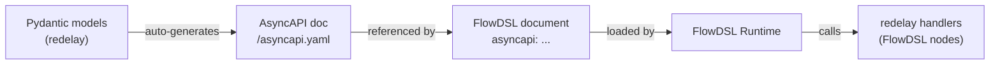

[Redelay](https://redelay.com) is a Python/FastAPI event framework — the first FlowDSL integration partner. It automatically generates AsyncAPI documents from Pydantic event models and provides the natural backend for Python-based FlowDSL flows.

## What redelay is

Redelay is a Python library that lets you define events as Pydantic models and subscribe to them as FastAPI route handlers. It generates an AsyncAPI document from your Pydantic models automatically — no manual schema writing.

```python
# redelay: define events as Pydantic models
from redelay import event, subscribe
from pydantic import BaseModel

class OrderPlaced(BaseModel):
    order_id: str
    customer_id: str
    total: float
    currency: str

@subscribe(OrderPlaced)
async def handle_order_placed(event: OrderPlaced):
    # process the order
    pass
```

Running this app with `redelay serve` generates an AsyncAPI document at `/asyncapi.yaml`:

```yaml
asyncapi: "2.6.0"
info:
  title: Order Service Events
  version: "1.0.0"
channels:
  orders/order-placed:
    subscribe:
      message:
        $ref: "#/components/messages/OrderPlaced"
components:
  messages:
    OrderPlaced:
      payload:
        type: object
        properties:
          order_id: { type: string }
          customer_id: { type: string }
          total: { type: number }
          currency: { type: string }
        required: [order_id, customer_id, total, currency]
```

## Connecting redelay to FlowDSL

### Step 1: Start your redelay service

```bash
pip install redelay flowdsl-py
redelay serve --host 0.0.0.0 --port 8090
```

The AsyncAPI document is now available at `http://localhost:8090/asyncapi.yaml`.

### Step 2: Reference it in FlowDSL

```yaml
flowdsl: "1.0"
info:
  title: Order Processing Flow
  version: "1.0.0"

asyncapi: http://localhost:8090/asyncapi.yaml

nodes:
  OrderReceived:
    operationId: receive_order_event
    kind: source
    outputs:
      out:
        packet: "asyncapi#/components/messages/OrderPlaced"

  ProcessOrder:
    operationId: process_order
    kind: action
    inputs:
      in:
        packet: "asyncapi#/components/messages/OrderPlaced"

edges:
  - from: OrderReceived
    to: ProcessOrder
    delivery:
      mode: durable
      packet: "asyncapi#/components/messages/OrderPlaced"
```

### Step 3: Implement FlowDSL nodes as redelay handlers

The `flowdsl-py` package provides a redelay integration module that lets you run FlowDSL node handlers as redelay subscribers:

```python
from redelay import subscribe
from flowdsl.redelay import as_flowdsl_node
from pydantic import BaseModel

class OrderPlaced(BaseModel):
    order_id: str
    customer_id: str
    total: float

@subscribe(OrderPlaced)
@as_flowdsl_node(operation_id="process_order")
async def process_order(event: OrderPlaced):
    # This handler is automatically registered as a FlowDSL node
    # The FlowDSL runtime calls it when packets arrive on the edge
    result = await charge_payment(event.order_id, event.total)
    return {"orderId": event.order_id, "chargeId": result.charge_id}
```

### Step 4: Register with the FlowDSL runtime

```yaml
# node-registry.yaml
nodes:
  process_order:
    address: localhost:8090
    runtime: python
    version: "1.0.0"
```

## How it fits together



## Benefits of the redelay integration

| Benefit | How |
|---------|-----|
| No schema duplication | Pydantic models → AsyncAPI → FlowDSL (one source of truth) |
| Type safety | Pydantic validation for all event schemas |
| FastAPI ecosystem | Use all FastAPI middleware, auth, and tooling |
| Auto-documented | redelay serves AsyncAPI UI at `/asyncapi-ui` |
| Incremental adoption | Add FlowDSL orchestration without rewriting existing handlers |

## Summary

- redelay generates AsyncAPI from Pydantic models automatically
- Reference the generated AsyncAPI in your FlowDSL `asyncapi` field
- Use `flowdsl-py`'s redelay integration to run node handlers as redelay subscribers
- FlowDSL handles orchestration; redelay handles Python event handling

## Next steps

- [AsyncAPI Integration](/docs/guides/asyncapi-integration) — full AsyncAPI integration guide
- [Writing a Python Node](/docs/tutorials/writing-a-python-node) — implement nodes with `flowdsl-py`
- [Python SDK Reference](/docs/tools/python-sdk) — full SDK API reference
