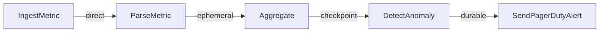

FlowDSL handles two fundamentally different workload classes. Recognizing which you're building determines your delivery mode choices, node design patterns, and operational approach.

## Stateful workflows

A stateful workflow processes each event as a complete, independent unit of work. Each event has business significance — it represents a real-world transaction, a support request, a user action. Losing an event is a business problem.

**Characteristics:**
- Each event matters individually
- Multiple external interactions per event (LLM calls, database writes, API calls)
- Long processing time (seconds to minutes)
- Data loss is unacceptable
- Idempotency is required

**Examples:**
- Order fulfillment (receive order → validate → charge → ship)
- Email triage (fetch → classify → route → notify)
- Support ticket resolution (create → classify → draft → reply)
- Lead processing (receive → enrich → score → route → assign)

**Dominant delivery modes:** `durable` + `idempotencyKey`

```yaml
# Stateful workflow: all durable
edges:
  - from: OrderReceived
    to: ValidateOrder
    delivery:
      mode: direct        # Fast validation, data recoverable from source

  - from: ValidateOrder
    to: ChargePayment
    delivery:
      mode: durable  # Critical: payment must not be lost or duplicated
      idempotencyKey: "{{payload.orderId}}-charge"

  - from: ChargePayment
    to: SendConfirmation
    delivery:
      mode: durable  # Critical: confirmation email must not duplicate
      idempotencyKey: "{{payload.orderId}}-confirm"
```

## Streaming pipelines

A streaming pipeline processes a continuous, high-volume stream of events where individual events are less significant but aggregate throughput matters. Losing a handful of events is acceptable (or events are easily replayed from the source).

**Characteristics:**
- High volume (thousands to millions of events per second)
- Each step is cheap and deterministic
- Processing time is microseconds to milliseconds
- Events can be replayed from the source (Kafka, S3, database)
- Throughput > durability for early stages

**Examples:**
- Log processing (ingest → parse → filter → aggregate → store)
- Telemetry pipeline (collect → normalize → deduplicate → enrich → index)
- Click stream processing (receive → extract → sessionize → compute → store)
- IoT sensor data (ingest → validate → transform → store → alert)

**Dominant delivery modes:** `direct` + `ephemeral` + `checkpoint`

```yaml
# Streaming pipeline: modes escalate as value increases
edges:
  - from: IngestLog
    to: ParseLog
    delivery:
      mode: direct            # Fast, in-process, 1M+/sec

  - from: ParseLog
    to: EnrichWithGeoIP
    delivery:
      mode: ephemeral    # Worker pool, burst absorption, ~50k/sec
      stream: log-enrich

  - from: EnrichWithGeoIP
    to: AggregateByService
    delivery:
      mode: checkpoint        # Stage-level resume, ~10k/sec
      batchSize: 500

  - from: AggregateByService
    to: DetectAnomalies
    delivery:
      mode: durable      # LLM call: expensive, must not duplicate
      idempotencyKey: "{{payload.windowId}}-anomaly"
```

## How to identify which you have

Ask these questions about each incoming event:

| Question | Stateful | Streaming |
|----------|---------|-----------|
| Does losing this event cause a business problem? | Yes | No (or data is replayable) |
| Does this event trigger external side effects? | Yes (SMS, email, payment) | Rarely |
| Is each event individually significant? | Yes | No — aggregate matters |
| Can I tolerate >1ms latency? | Yes (seconds are fine) | No — microseconds needed |
| Volume per second? | Low–medium (<1000) | High (>1000) |

## Mixed flows

Real-world flows often combine both patterns. A telemetry pipeline that detects anomalies and sends alerts is primarily streaming (cheap telemetry processing) with a stateful tail (durable alert delivery):



The `direct → ephemeral → checkpoint` chain is streaming. The `durable` at the alert step switches to stateful semantics for the business-critical notification.

## Summary

| Attribute | Stateful | Streaming |
|-----------|---------|-----------|
| Event significance | Each matters | Aggregate matters |
| Primary modes | `durable` | `direct`, `ephemeral`, `checkpoint` |
| Idempotency | Required | Usually not needed |
| Throughput | Low–medium | High |
| Acceptable latency | High | Low |

## Next steps

- [Choosing Delivery Modes](/docs/guides/choosing-delivery-modes) — decision tree for each edge
- [High-Throughput Pipelines](/docs/guides/high-throughput-pipelines) — optimizing streaming flows
- [Idempotency](/docs/guides/idempotency) — required for stateful workflows
