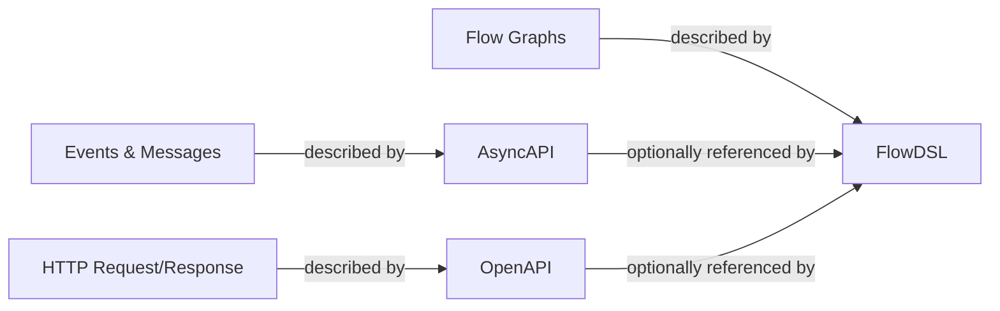

## What is FlowDSL?

FlowDSL is a **domain-specific language** (DSL) for describing executable event-driven flow graphs.

A DSL is a specialized language designed for one specific problem domain — SQL is the DSL for querying databases, HTML is the DSL for web page structure, CSS is the DSL for styling. FlowDSL is the DSL for **event-driven orchestration**: it gives you a precise, readable notation for flows, nodes, edges, delivery policies, retry semantics, and runtime guarantees.

Unlike general-purpose code where transport logic gets hardcoded into every service, FlowDSL separates *what your system does* (nodes) from *how data moves between steps* (edges). The runtime reads the FlowDSL document and enforces the guarantees you declared.

| You already know | It's the DSL for |
|-----------------|-----------------|
| SQL | Database queries |
| HTML | Web page structure |
| CSS | Visual styling |
| AsyncAPI | Event and message contracts |
| **FlowDSL** | **Event-driven flow orchestration** |

FlowDSL sits alongside OpenAPI and AsyncAPI as a sibling specification:

- **OpenAPI** describes your HTTP interfaces
- **AsyncAPI** describes your event and message contracts
- **FlowDSL** describes your executable flow graphs and runtime semantics

FlowDSL references AsyncAPI message definitions instead of duplicating them — keeping a clean separation between message contracts and orchestration logic.

::tip{icon="i-heroicons-bolt"}
**Core principle:** Nodes define business logic. Edges define delivery semantics. The runtime enforces guarantees.
::

## What you'll find here

::tip
New to FlowDSL? Start with [Getting Started](/docs/tutorials/getting-started) to run your first flow in 5 minutes.
::

| Section | What's inside |
|---------|--------------|
| [Concepts](/docs/concepts) | The vocabulary of FlowDSL — nodes, edges, delivery modes, packets |
| [Tutorials](/docs/tutorials) | Step-by-step walkthroughs for building real flows |
| [Guides](/docs/guides) | Practical decisions: delivery mode selection, LLM flows, error handling |
| [Reference](/docs/reference) | Field-by-field spec reference for every object |
| [Tools](/docs/tools) | Studio, CLI, Go SDK, Python SDK, JS SDK |
| [Community](/docs/community) | Contributing, code of conduct, roadmap |

## Why FlowDSL?

Most teams describe their event-driven systems in one of three ways — and all three have significant drawbacks.

### vs hardcoding Kafka consumers

When you hardcode Kafka consumers directly in your services, the topology of your flow is buried in application code. To understand the full data path, you have to read multiple codebases and grep for topic names. Delivery semantics — retries, dead letters, fan-out — are either absent or inconsistently implemented across teams.

FlowDSL separates topology from transport. The `.flowdsl.yaml` document declares what connects to what and how, independently of any implementation language. The runtime enforces the delivery semantics so your application code stays clean.

### vs Temporal / Airflow

Temporal and Airflow are powerful orchestration systems, but they are workflow engines first, not specifications. You describe workflows in code (Go, Python, Java), tied to a specific runtime. Portability across runtimes is an afterthought.

FlowDSL is spec-first. The same `.flowdsl.yaml` file can be loaded by the Go runtime, the Python runtime, or any future runtime that implements the spec. The runtime is a pluggable implementation detail, not a vendor lock-in.

### vs n8n / Zapier

n8n and Zapier are excellent for non-technical users wiring together SaaS integrations through a browser UI. But they are closed platforms, not open specifications. Your flows live inside the platform, not in your version control system.

FlowDSL is code-first and developer-native. Flows are YAML or JSON files, committed to git, reviewed in pull requests, and validated in CI pipelines. The visual editor (Studio) is a convenience, not a requirement.

## Where FlowDSL sits in the API ecosystem

FlowDSL occupies a distinct layer alongside OpenAPI and AsyncAPI:



- **OpenAPI** describes the shape of HTTP APIs
- **AsyncAPI** describes event and message contracts
- **FlowDSL** describes executable flow graphs with delivery semantics

FlowDSL is fully self-contained. You do not need an AsyncAPI or OpenAPI document to write a FlowDSL flow — packets and events are defined natively in the `components` section. AsyncAPI and OpenAPI are optional integrations for teams that already have those contracts.

## A minimal FlowDSL flow

```yaml
flowdsl: "1.0"
info:
  title: Order Notification
  version: "1.0.0"

nodes:
  OrderReceived:
    operationId: receive_order
    kind: source
    summary: Receives new order events

  NotifyCustomer:
    operationId: notify_customer
    kind: action
    summary: Sends a confirmation email

edges:
  - from: OrderReceived
    to: NotifyCustomer
    delivery:
      mode: durable
      packet: OrderPayload

components:
  packets:
    OrderPayload:
      type: object
      properties:
        orderId:
          type: string
        customerId:
          type: string
        total:
          type: number
      required: [orderId, customerId, total]
```

This is a complete FlowDSL document. It declares two nodes with their roles, one edge connecting them, and the packet schema that flows between them. The runtime reads this and wires everything together — you never write Kafka consumer code or MongoDB retry logic by hand.

## Quick start

```bash
# Clone the examples repository
git clone https://github.com/flowdsl/examples

# Start all infrastructure (MongoDB, Redis, Kafka, Studio)
cd examples && make up-infra

# Open FlowDSL Studio
open http://localhost:5173
```

Load the **Order Fulfillment** example in Studio, click **Validate**, and explore your first flow. The [Getting Started tutorial](/docs/tutorials/getting-started) walks through every step.

## The ecosystem

FlowDSL is an open-source specification with a growing ecosystem of commercial tools:

| Product | What it is |
|---------|-----------|
| **flowdsl.com** | Open source specification, Studio, SDKs, reference runtime |
| **Node Catalog** | Community and premium node marketplace *(coming soon)* |
| **Cloud Service** | Managed workflow hosting — deploy and run flows *(coming soon)* |

All specification development happens in the open at [github.com/flowdsl](https://github.com/flowdsl). Apache 2.0 licensed.

## Next steps

- [What is FlowDSL?](/docs/concepts/what-is-flowdsl) — understand the spec from first principles
- [Getting Started](/docs/tutorials/getting-started) — run a flow in 5 minutes
- [Delivery Modes](/docs/concepts/delivery-modes) — the most important concept in FlowDSL
- [GitHub](https://github.com/flowdsl) — source code, issues, discussions

## AI Integration

FlowDSL docs are AI-native. Connect your IDE to the FlowDSL MCP server for real-time documentation access:

::code-group
```bash [Claude Code]
claude mcp add --transport http flowdsl-docs https://flowdsl.com/mcp
```

```json [Cursor (.cursor/mcp.json)]
{
  "mcpServers": {
    "flowdsl-docs": {
      "type": "http",
      "url": "https://flowdsl.com/mcp"
    }
  }
}
```

```json [VS Code (.vscode/mcp.json)]
{
  "servers": {
    "flowdsl-docs": {
      "type": "http",
      "url": "https://flowdsl.com/mcp"
    }
  }
}
```
::
