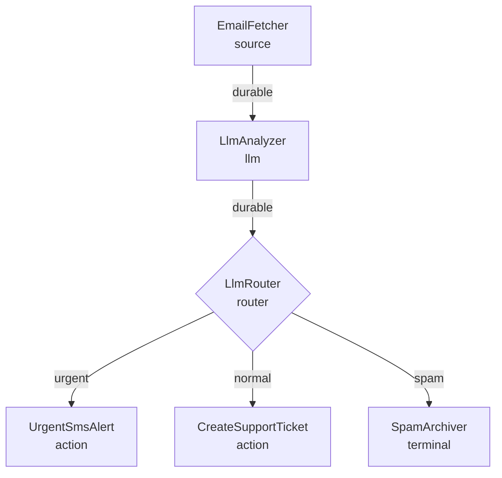

This tutorial builds a production-ready email triage workflow using FlowDSL. An LLM classifies incoming emails as urgent, normal, or spam, and routes them to the appropriate handler — SMS alert, support ticket, or spam archive.

## What you'll build



## 1. Design: what problem this solves

Your support inbox receives hundreds of emails per day. The team's on-call engineer needs to be paged immediately for genuinely urgent issues (production outages, security incidents) but must not be paged for routine requests. Spam must be auto-archived. Everything else becomes a support ticket.

Manual triage is slow and inconsistent. This flow automates it with an LLM classifier that reads each email and routes it in under a second.

## 2. Flow document skeleton

```yaml
flowdsl: "1.0"
info:
  title: Email Triage
  version: "1.0.0"
  description: |
    Classifies incoming support emails as urgent, normal, or spam
    using an LLM and routes them to the appropriate handler.

nodes: {}
edges: []
components:
  packets: {}
```

## 3. Add the EmailFetcher node

The `EmailFetcher` polls an IMAP inbox or listens on a webhook from the email provider:

```yaml
nodes:
  EmailFetcher:
    operationId: fetch_email
    kind: source
    summary: Fetches new emails from the support inbox
    outputs:
      out:
        packet: EmailPayload
    settings:
      imapHost: imap.support.mycompany.com
      imapPort: 993
      pollIntervalSeconds: 30
```

## 4. Add the LlmAnalyzer node

The LLM reads the email subject and body and returns a classification with confidence score:

```yaml
nodes:
  LlmAnalyzer:
    operationId: llm_analyze_email
    kind: llm
    summary: Classifies email priority using an LLM
    inputs:
      in:
        packet: EmailPayload
    outputs:
      out:
        packet: AnalysisResult
    settings:
      model: gpt-4o-mini
      temperature: 0.1
      systemPrompt: |
        You are an expert support email classifier.
        Classify the email as exactly one of: urgent, normal, or spam.

        Urgent: production outages, security incidents, data loss, legal issues.
        Normal: feature requests, bug reports, billing questions, general support.
        Spam: promotional emails, irrelevant content, automated notifications.

        Respond with JSON: {"classification": "urgent|normal|spam", "confidence": 0.0-1.0, "reason": "..."}
```

Add the edge from `EmailFetcher` to `LlmAnalyzer`. This is the most critical edge in the flow — an LLM call costs money and must not be re-run unnecessarily:

```yaml
edges:
  - from: EmailFetcher
    to: LlmAnalyzer
    delivery:
      mode: durable
      packet: EmailPayload
      idempotencyKey: "{{payload.messageId}}-analyze"
      retryPolicy:
        maxAttempts: 3
        backoff: exponential
        initialDelay: PT5S
        maxDelay: PT60S
        retryOn: [RATE_LIMITED, TIMEOUT]
```

**Why `durable` with `idempotencyKey`?** If the process crashes between the LLM response and the acknowledgment, the runtime will retry. Without an idempotency key, the LLM call would be made again — wasting money and potentially producing different results. The `messageId` ensures each email is analyzed exactly once.

## 5. Add the LlmRouter node

```yaml
nodes:
  LlmRouter:
    operationId: route_by_classification
    kind: router
    summary: Routes emails based on LLM classification
    inputs:
      in:
        packet: AnalysisResult
    outputs:
      urgent:
        packet: AnalysisResult
        description: Production issues, security incidents
      normal:
        packet: AnalysisResult
        description: Standard support requests
      spam:
        packet: AnalysisResult
        description: Promotional and irrelevant emails
```

```yaml
edges:
  - from: LlmAnalyzer
    to: LlmRouter
    delivery:
      mode: durable
      packet: AnalysisResult
```

## 6. Add UrgentSmsAlert with retry and idempotency

```yaml
nodes:
  UrgentSmsAlert:
    operationId: send_urgent_sms
    kind: action
    summary: Sends an SMS to the on-call engineer via Twilio
    inputs:
      in:
        packet: AnalysisResult
    settings:
      twilioFromNumber: "+15550100200"
      oncallNumber: "+15550100300"
```

```yaml
edges:
  - from: LlmRouter.urgent
    to: UrgentSmsAlert
    delivery:
      mode: durable
      packet: AnalysisResult
      idempotencyKey: "{{payload.email.messageId}}-sms"
      retryPolicy:
        maxAttempts: 4
        backoff: exponential
        initialDelay: PT2S
        maxDelay: PT30S
        jitter: true
```

**Why `idempotencyKey` here?** SMS is an irreversible side effect — sending the same alert twice wakes someone up twice. The idempotency key ensures the SMS is sent exactly once even if the node retries.

## 7. Add CreateSupportTicket

```yaml
nodes:
  CreateSupportTicket:
    operationId: create_support_ticket
    kind: action
    summary: Creates a support ticket in the ticketing system
    inputs:
      in:
        packet: AnalysisResult
    settings:
      ticketingSystem: zendesk
      defaultPriority: normal
```

```yaml
edges:
  - from: LlmRouter.normal
    to: CreateSupportTicket
    delivery:
      mode: durable
      packet: AnalysisResult
      idempotencyKey: "{{payload.email.messageId}}-ticket"
      retryPolicy:
        maxAttempts: 3
        backoff: exponential
        initialDelay: PT3S
```

## 8. Add SpamArchiver

```yaml
nodes:
  SpamArchiver:
    operationId: archive_spam
    kind: terminal
    summary: Archives the email in the spam folder
    inputs:
      in:
        packet: AnalysisResult
```

```yaml
edges:
  - from: LlmRouter.spam
    to: SpamArchiver
    delivery:
      mode: direct
      packet: AnalysisResult
```

**Why `direct` for spam?** Archiving spam is fast and idempotent — writing to a spam folder twice is harmless. `direct` avoids unnecessary MongoDB overhead.

## 9. Complete final YAML

```yaml
flowdsl: "1.0"
info:
  title: Email Triage
  version: "1.0.0"
  description: |
    Classifies incoming support emails as urgent, normal, or spam
    using an LLM and routes them to the appropriate handler.

nodes:
  EmailFetcher:
    operationId: fetch_email
    kind: source
    summary: Fetches new emails from the support inbox
    outputs:
      out: { packet: EmailPayload }
    settings:
      imapHost: imap.support.mycompany.com
      pollIntervalSeconds: 30

  LlmAnalyzer:
    operationId: llm_analyze_email
    kind: llm
    summary: Classifies email priority using an LLM
    inputs:
      in: { packet: EmailPayload }
    outputs:
      out: { packet: AnalysisResult }
    settings:
      model: gpt-4o-mini
      temperature: 0.1
      systemPrompt: |
        Classify the email as: urgent, normal, or spam.
        Respond with JSON: {"classification": "urgent|normal|spam", "confidence": 0.0-1.0, "reason": "..."}

  LlmRouter:
    operationId: route_by_classification
    kind: router
    inputs:
      in: { packet: AnalysisResult }
    outputs:
      urgent: { packet: AnalysisResult }
      normal: { packet: AnalysisResult }
      spam: { packet: AnalysisResult }

  UrgentSmsAlert:
    operationId: send_urgent_sms
    kind: action
    inputs:
      in: { packet: AnalysisResult }
    settings:
      twilioFromNumber: "+15550100200"
      oncallNumber: "+15550100300"

  CreateSupportTicket:
    operationId: create_support_ticket
    kind: action
    inputs:
      in: { packet: AnalysisResult }
    settings:
      ticketingSystem: zendesk

  SpamArchiver:
    operationId: archive_spam
    kind: terminal
    inputs:
      in: { packet: AnalysisResult }

edges:
  - from: EmailFetcher
    to: LlmAnalyzer
    delivery:
      mode: durable
      packet: EmailPayload
      idempotencyKey: "{{payload.messageId}}-analyze"
      retryPolicy:
        maxAttempts: 3
        backoff: exponential
        initialDelay: PT5S
        retryOn: [RATE_LIMITED, TIMEOUT]

  - from: LlmAnalyzer
    to: LlmRouter
    delivery:
      mode: durable
      packet: AnalysisResult

  - from: LlmRouter.urgent
    to: UrgentSmsAlert
    delivery:
      mode: durable
      packet: AnalysisResult
      idempotencyKey: "{{payload.email.messageId}}-sms"
      retryPolicy:
        maxAttempts: 4
        backoff: exponential
        initialDelay: PT2S
        maxDelay: PT30S
        jitter: true

  - from: LlmRouter.normal
    to: CreateSupportTicket
    delivery:
      mode: durable
      packet: AnalysisResult
      idempotencyKey: "{{payload.email.messageId}}-ticket"
      retryPolicy:
        maxAttempts: 3
        backoff: exponential
        initialDelay: PT3S

  - from: LlmRouter.spam
    to: SpamArchiver
    delivery:
      mode: direct
      packet: AnalysisResult

components:
  packets:
    EmailPayload:
      type: object
      properties:
        messageId: { type: string }
        from: { type: string, format: email }
        to: { type: string, format: email }
        subject: { type: string }
        body: { type: string }
        receivedAt: { type: string, format: date-time }
        headers: { type: object, additionalProperties: true }
      required: [messageId, from, subject, body, receivedAt]

    AnalysisResult:
      type: object
      properties:
        email:
          $ref: "#/components/packets/EmailPayload"
        classification:
          type: string
          enum: [urgent, normal, spam]
        confidence:
          type: number
          minimum: 0
          maximum: 1
        reason:
          type: string
        analyzedAt:
          type: string
          format: date-time
      required: [email, classification, confidence, analyzedAt]
```

## 10. Load in Studio and monitor

Drag the YAML into Studio. You'll see the six nodes and five edges with color-coded delivery mode badges on each edge.

Click **Run Sample** and enter a test email payload:

```json
{
  "messageId": "msg-001",
  "from": "user@example.com",
  "subject": "Production database is down",
  "body": "Our primary database is returning connection refused errors. All services are affected.",
  "receivedAt": "2026-03-28T10:00:00Z"
}
```

Watch the execution monitor show each node firing in sequence, the LLM classification returning `urgent`, and the SMS alert being enqueued.

## Summary

| Pattern | Where used | Why |
|---------|-----------|-----|
| `durable` + `idempotencyKey` | LLM edge, SMS edge, ticket edge | Expensive side effects that must not duplicate |
| Exponential backoff with jitter | SMS and ticket edges | Avoid retry storms against rate-limited services |
| `direct` for spam | Spam archival | Fast, idempotent, no durability needed |
| `router` node | LlmRouter | Code-driven multi-way routing |

## Next steps

- [LLM Flows](/docs/guides/llm-flows) — deep dive into LLM orchestration patterns
- [Idempotency](/docs/guides/idempotency) — how to write safe idempotent node handlers
- [Write a Python Node](/docs/tutorials/writing-a-python-node) — implement the `LlmAnalyzer` in Python
