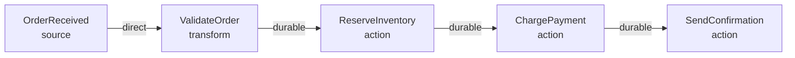

This tutorial gets you from zero to a running flow in five minutes. You will clone the example repository, start the infrastructure, open FlowDSL Studio, and explore a real order fulfillment flow.

## What you'll learn

- How to start the FlowDSL infrastructure stack with Docker Compose
- How to open and navigate FlowDSL Studio
- How to validate a FlowDSL document
- What the key parts of a flow document mean

## Prerequisites

- **Docker Desktop** — [download here](https://www.docker.com/products/docker-desktop)
- **Git**
- **Node.js 20+** (for Studio development mode, optional)
- **Go 1.21+** (optional, for running node implementations)

## Step 1: Clone the examples repository

```bash
git clone https://github.com/flowdsl/examples
cd examples
```

The repository contains several complete flow examples, the infrastructure Docker Compose file, and pre-built node implementations.

## Step 2: Start the infrastructure

```bash
make up-infra
```

This starts:

| Service | Port | What it is |
|---------|------|-----------|
| MongoDB | 27017 | Backing store for `durable` and `checkpoint` |
| Redis | 6379 | Backing store for `ephemeral` |
| Kafka | 9092 | Backing store for `stream` |
| Zookeeper | 2181 | Kafka coordinator |
| FlowDSL Studio | 5173 | Visual editor |
| FlowDSL Runtime | 8081 | The runtime API |

Wait for all services to show `healthy` in `docker compose ps`.

```bash
docker compose ps
```

```
NAME              STATUS    PORTS
flowdsl-mongodb   healthy   0.0.0.0:27017->27017/tcp
flowdsl-redis     healthy   0.0.0.0:6379->6379/tcp
flowdsl-kafka     healthy   0.0.0.0:9092->9092/tcp
flowdsl-studio    healthy   0.0.0.0:5173->5173/tcp
flowdsl-runtime   healthy   0.0.0.0:8081->8081/tcp
```

## Step 3: Open FlowDSL Studio

Navigate to [http://localhost:5173](http://localhost:5173) in your browser.


You'll see the Studio canvas — an empty graph editor with a toolbar at the top and a node palette on the right.

## Step 4: Load the Order Fulfillment example

Click **File → Open Example → Order Fulfillment** or drag the file `examples/order-fulfillment/order-fulfillment.flowdsl.yaml` into the Studio canvas.


You'll see five nodes laid out on the canvas:



## Step 5: Validate the flow

Click the **Validate** button in the top toolbar.

The validator checks:
- The document conforms to the FlowDSL JSON Schema
- All referenced packet types exist in `components.packets`
- All `operationId` values are unique
- All edges reference valid node names

You should see a green **Valid** status. If you see errors, they'll appear in the Validation panel with file paths and line numbers.

## Step 6: Export to JSON

Click **File → Export → JSON** to see the canonical form of the document.

```json
{
  "flowdsl": "1.0",
  "info": {
    "title": "Order Fulfillment",
    "version": "1.0.0"
  },
  "nodes": {
    "OrderReceived": {
      "operationId": "receive_order",
      "kind": "source"
    },
    "ValidateOrder": {
      "operationId": "validate_order",
      "kind": "transform"
    },
    "ReserveInventory": {
      "operationId": "reserve_inventory",
      "kind": "action"
    },
    "ChargePayment": {
      "operationId": "charge_payment",
      "kind": "action"
    },
    "SendConfirmation": {
      "operationId": "send_confirmation",
      "kind": "action"
    }
  },
  "edges": [
    {
      "from": "OrderReceived",
      "to": "ValidateOrder",
      "delivery": { "mode": "direct", "packet": "OrderPayload" }
    },
    {
      "from": "ValidateOrder",
      "to": "ReserveInventory",
      "delivery": {
        "mode": "durable",
        "packet": "ValidatedOrder",
        "retryPolicy": {
          "maxAttempts": 3,
          "backoff": "exponential",
          "initialDelay": "PT2S"
        }
      }
    },
    {
      "from": "ReserveInventory",
      "to": "ChargePayment",
      "delivery": {
        "mode": "durable",
        "packet": "ReservationResult",
        "idempotencyKey": "{{payload.orderId}}-charge"
      }
    },
    {
      "from": "ChargePayment",
      "to": "SendConfirmation",
      "delivery": {
        "mode": "durable",
        "packet": "PaymentResult",
        "idempotencyKey": "{{payload.orderId}}-confirm"
      }
    }
  ],
  "components": {
    "packets": { "...": "..." }
  }
}
```

## Step 7: Understand the document

**`info`** — document metadata: title, version, who owns it.

**`nodes`** — the graph vertices. Each node has:
- `operationId` — the handler function name (snake_case)
- `kind` — the node's role (source, transform, action, etc.)

**`edges`** — the graph edges connecting nodes. Each edge has:
- `from` / `to` — which nodes to connect
- `delivery.mode` — transport and durability (this is the key decision)

**`components.packets`** — the typed schemas for data flowing between nodes.

**Why `direct` for validation but `durable` for payment?**

`ValidateOrder` is a fast, deterministic, in-process check. If it fails, the upstream system resends the order. `direct` is correct here — no durability needed.

`ChargePayment` calls an external payment processor. If the process crashes between the charge and the confirmation, you need the packet to survive the restart and the idempotency key to prevent double-charging. `durable` with `idempotencyKey` is the only safe choice.

## What's next

You've seen a running flow and understood its structure. Now build one from scratch:

- [Your First Flow](/docs/tutorials/your-first-flow) — build a webhook-to-Slack routing flow step by step
- [Delivery Modes](/docs/concepts/delivery-modes) — understand the five modes in depth
- [Nodes](/docs/concepts/nodes) — the nine node kinds explained
