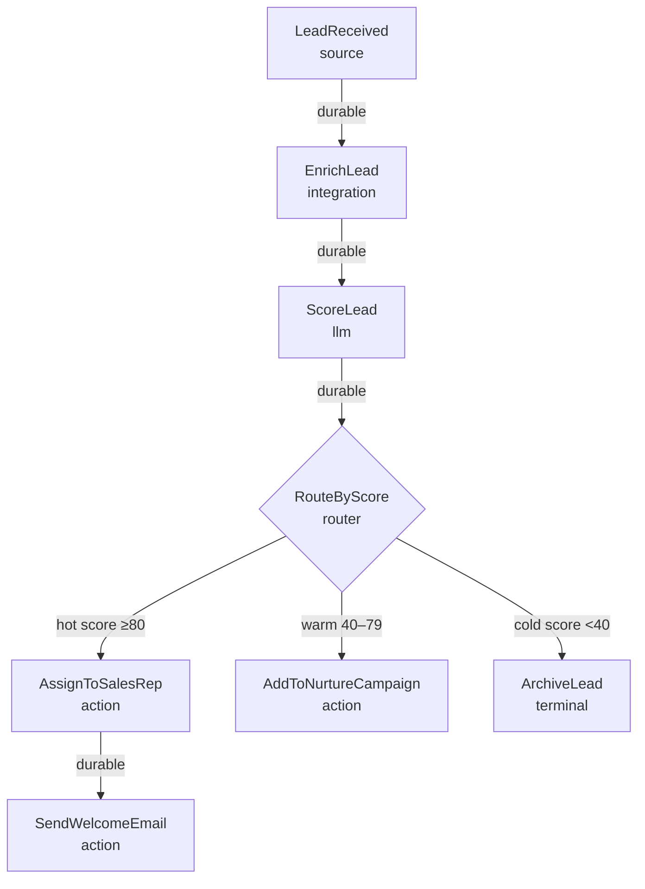

This tutorial builds a lead processing pipeline that enriches incoming leads with external data, scores them using an LLM, and routes them to the correct sales action based on their score.

## What you'll build



## The complete flow YAML

```yaml
flowdsl: "1.0"
info:
  title: Sales Pipeline
  version: "1.0.0"
  description: |
    Processes incoming leads: enriches from Clearbit, scores with LLM,
    routes hot/warm/cold to appropriate sales actions.

nodes:
  LeadReceived:
    operationId: receive_lead
    kind: source
    summary: Receives new lead submissions from the website form or CRM webhook
    outputs:
      out: { packet: LeadPayload }

  EnrichLead:
    operationId: enrich_lead_clearbit
    kind: integration
    summary: Enriches lead data from Clearbit (company size, industry, funding)
    inputs:
      in: { packet: LeadPayload }
    outputs:
      out: { packet: EnrichedLead }
    settings:
      clearbitApiKey: "${CLEARBIT_API_KEY}"
      enrichFields: [company, person, employment]

  ScoreLead:
    operationId: llm_score_lead
    kind: llm
    summary: Scores the lead 0–100 based on ICP fit using LLM
    inputs:
      in: { packet: EnrichedLead }
    outputs:
      out: { packet: ScoredLead }
    settings:
      model: gpt-4o-mini
      temperature: 0.2
      systemPrompt: |
        You are a B2B sales qualification expert. Score this lead 0-100 based on
        ideal customer profile fit. Consider: company size (prefer 50-500 employees),
        industry fit, funding stage, and seniority of contact.

        Return JSON: {"score": 0-100, "tier": "hot|warm|cold", "reasoning": "...", "topSignals": [...]}

  RouteByScore:
    operationId: route_lead_by_score
    kind: router
    summary: Routes leads based on their ICP score
    inputs:
      in: { packet: ScoredLead }
    outputs:
      hot:
        packet: ScoredLead
        description: Score ≥80 — assign to a sales rep immediately
      warm:
        packet: ScoredLead
        description: Score 40–79 — add to nurture campaign
      cold:
        packet: ScoredLead
        description: Score <40 — archive

  AssignToSalesRep:
    operationId: assign_sales_rep
    kind: action
    summary: Assigns the lead to a sales rep via round-robin in the CRM
    inputs:
      in: { packet: ScoredLead }
    outputs:
      out: { packet: AssignedLead }
    settings:
      crmSystem: salesforce
      assignmentStrategy: round-robin
      territory: us-west

  SendWelcomeEmail:
    operationId: send_welcome_email
    kind: action
    summary: Sends a personalized welcome email to the hot lead
    inputs:
      in: { packet: AssignedLead }
    settings:
      templateId: hot-lead-welcome-v3
      senderName: "Sales Team"

  AddToNurtureCampaign:
    operationId: add_to_nurture_campaign
    kind: action
    summary: Enrolls the lead in a 6-email nurture sequence
    inputs:
      in: { packet: ScoredLead }
    settings:
      campaignId: nurture-sequence-q1-2026
      startDelay: PT24H

  ArchiveLead:
    operationId: archive_cold_lead
    kind: terminal
    summary: Archives the lead with cold classification for future re-engagement
    inputs:
      in: { packet: ScoredLead }

edges:
  # Enrich incoming lead — durable because external API call
  - from: LeadReceived
    to: EnrichLead
    delivery:
      mode: durable
      packet: LeadPayload
      idempotencyKey: "{{payload.leadId}}-enrich"
      retryPolicy:
        maxAttempts: 3
        backoff: exponential
        initialDelay: PT3S
        retryOn: [TIMEOUT, RATE_LIMITED]

  # LLM scoring — durable + idempotency (expensive, non-deterministic)
  - from: EnrichLead
    to: ScoreLead
    delivery:
      mode: durable
      packet: EnrichedLead
      idempotencyKey: "{{payload.leadId}}-score"
      retryPolicy:
        maxAttempts: 3
        backoff: exponential
        initialDelay: PT5S
        retryOn: [RATE_LIMITED, TIMEOUT]

  # Route to appropriate path
  - from: ScoreLead
    to: RouteByScore
    delivery:
      mode: durable
      packet: ScoredLead

  # Hot path — assign to sales rep immediately
  - from: RouteByScore.hot
    to: AssignToSalesRep
    delivery:
      mode: durable
      packet: ScoredLead
      idempotencyKey: "{{payload.leadId}}-assign"
      retryPolicy:
        maxAttempts: 3
        backoff: exponential
        initialDelay: PT2S

  # Welcome email for hot leads after assignment
  - from: AssignToSalesRep
    to: SendWelcomeEmail
    delivery:
      mode: durable
      packet: AssignedLead
      idempotencyKey: "{{payload.leadId}}-welcome-email"
      retryPolicy:
        maxAttempts: 3
        backoff: exponential
        initialDelay: PT2S

  # Warm path — nurture campaign
  - from: RouteByScore.warm
    to: AddToNurtureCampaign
    delivery:
      mode: durable
      packet: ScoredLead
      idempotencyKey: "{{payload.leadId}}-nurture"
      retryPolicy:
        maxAttempts: 3
        backoff: exponential
        initialDelay: PT2S

  # Cold path — archive directly (fast, idempotent)
  - from: RouteByScore.cold
    to: ArchiveLead
    delivery:
      mode: direct
      packet: ScoredLead

components:
  packets:
    LeadPayload:
      type: object
      properties:
        leadId: { type: string }
        email: { type: string, format: email }
        firstName: { type: string }
        lastName: { type: string }
        company: { type: string }
        title: { type: string }
        phone: { type: string }
        source:
          type: string
          enum: [website, referral, event, linkedin, cold-outreach]
        submittedAt: { type: string, format: date-time }
      required: [leadId, email, company, source, submittedAt]

    EnrichedLead:
      type: object
      properties:
        lead:
          $ref: "#/components/packets/LeadPayload"
        clearbit:
          type: object
          properties:
            companySize:
              type: integer
              description: Number of employees
            industry: { type: string }
            fundingStage: { type: string }
            annualRevenue: { type: number }
            technologies: { type: array, items: { type: string } }
          additionalProperties: true
        enrichedAt: { type: string, format: date-time }
      required: [lead, enrichedAt]

    ScoredLead:
      type: object
      properties:
        lead:
          $ref: "#/components/packets/EnrichedLead"
        score:
          type: integer
          minimum: 0
          maximum: 100
        tier:
          type: string
          enum: [hot, warm, cold]
        reasoning: { type: string }
        topSignals:
          type: array
          items: { type: string }
        scoredAt: { type: string, format: date-time }
      required: [lead, score, tier, scoredAt]

    AssignedLead:
      type: object
      properties:
        lead:
          $ref: "#/components/packets/ScoredLead"
        assignedTo:
          type: object
          properties:
            repId: { type: string }
            repName: { type: string }
            repEmail: { type: string, format: email }
          required: [repId, repName, repEmail]
        crmLeadId: { type: string }
        assignedAt: { type: string, format: date-time }
      required: [lead, assignedTo, assignedAt]
```

## Delivery mode decisions

| Edge | Mode | Why |
|------|------|-----|
| LeadReceived → EnrichLead | durable | External API call, loss unacceptable |
| EnrichLead → ScoreLead | durable | Expensive LLM call with idempotency |
| ScoreLead → RouteByScore | durable | Business-critical classification |
| RouteByScore.hot → AssignToSalesRep | durable | CRM write, must not duplicate |
| AssignToSalesRep → SendWelcomeEmail | durable | Email send, must not duplicate |
| RouteByScore.warm → AddToNurtureCampaign | durable | Campaign enrollment, idempotent key |
| RouteByScore.cold → ArchiveLead | direct | Fast, idempotent, no external calls |

## Next steps

- [LLM Flows](/docs/guides/llm-flows) — deep patterns for LLM scoring and classification
- [Idempotency](/docs/guides/idempotency) — preventing duplicate CRM entries and emails
- [Email Triage Flow](/docs/tutorials/email-triage-flow) — another real-world stateful flow
