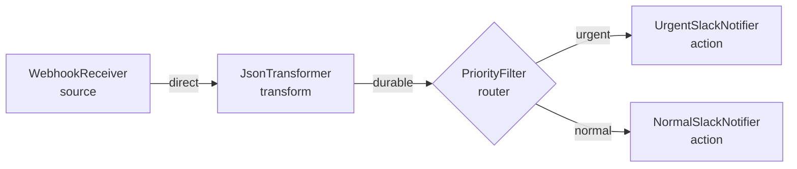

In this tutorial you will build a complete FlowDSL flow from an empty file, adding one node at a time and explaining every decision. The final flow routes incoming webhook events to Slack based on their priority level.

## What you'll build



A webhook receives a JSON POST → a transformer extracts key fields → a filter routes based on priority → the appropriate Slack channel is notified.

## Prerequisites

- A text editor
- Basic YAML familiarity
- `ajv-cli` for validation (optional): `npm install -g ajv-cli`

## Step 1: Document skeleton

Create a file called `webhook-router.flowdsl.yaml`:

```yaml
flowdsl: "1.0"
info:
  title: Webhook to Slack Router
  version: "1.0.0"
  description: |
    Routes incoming webhook events to Slack channels based on priority.
    Urgent events go to #incidents, normal events go to #notifications.

externalDocs:
  url: https://github.com/myorg/event-schemas/blob/main/asyncapi.yaml
  description: AsyncAPI event schema definitions

nodes: {}

edges: []

components:
  packets: {}
```

**Why `externalDocs`?** It documents where the event schemas live, even if you're not referencing them directly in this file. It makes the document self-documenting for future readers.

## Step 2: Add the WebhookReceiver source node

```yaml
flowdsl: "1.0"
info:
  title: Webhook to Slack Router
  version: "1.0.0"

nodes:
  WebhookReceiver:
    operationId: receive_webhook
    kind: source
    summary: Receives incoming webhook POST requests from external systems
    outputs:
      out:
        packet: WebhookPayload
        description: The raw webhook body

edges: []

components:
  packets: {}
```

**Why `kind: source`?** Source nodes have no incoming edges — they are entry points triggered by external events. The runtime registers `receive_webhook` as a handler for incoming HTTP POST requests on the webhook endpoint.

## Step 3: Add the JsonTransformer node and edge

```yaml
flowdsl: "1.0"
info:
  title: Webhook to Slack Router
  version: "1.0.0"

nodes:
  WebhookReceiver:
    operationId: receive_webhook
    kind: source
    outputs:
      out: { packet: WebhookPayload }

  JsonTransformer:
    operationId: transform_webhook_fields
    kind: transform
    summary: Extracts and normalizes key fields from the raw webhook body
    inputs:
      in: { packet: WebhookPayload }
    outputs:
      out: { packet: TransformedPayload }

edges:
  - from: WebhookReceiver
    to: JsonTransformer
    delivery:
      mode: direct
      packet: WebhookPayload

components:
  packets: {}
```

**Why `direct` here?** `JsonTransformer` is a cheap, deterministic, in-process field extraction. There's no external call, no side effect, and no need to survive a process crash. `direct` is the right mode — zero overhead.

## Step 4: Add the PriorityFilter router and conditional edges

```yaml
flowdsl: "1.0"
info:
  title: Webhook to Slack Router
  version: "1.0.0"

nodes:
  WebhookReceiver:
    operationId: receive_webhook
    kind: source
    outputs:
      out: { packet: WebhookPayload }

  JsonTransformer:
    operationId: transform_webhook_fields
    kind: transform
    inputs:
      in: { packet: WebhookPayload }
    outputs:
      out: { packet: TransformedPayload }

  PriorityFilter:
    operationId: filter_by_priority
    kind: router
    summary: Routes events to urgent or normal Slack channels based on priority field
    inputs:
      in: { packet: TransformedPayload }
    outputs:
      urgent:
        packet: TransformedPayload
        description: P0 and P1 events → #incidents
      normal:
        packet: TransformedPayload
        description: P2+ events → #notifications

edges:
  - from: WebhookReceiver
    to: JsonTransformer
    delivery:
      mode: direct
      packet: WebhookPayload

  - from: JsonTransformer
    to: PriorityFilter
    delivery:
      mode: direct
      packet: TransformedPayload

  - from: PriorityFilter.urgent
    to: UrgentSlackNotifier
    delivery:
      mode: durable
      packet: TransformedPayload
      retryPolicy:
        maxAttempts: 3
        backoff: exponential
        initialDelay: PT2S

  - from: PriorityFilter.normal
    to: NormalSlackNotifier
    delivery:
      mode: durable
      packet: TransformedPayload
      retryPolicy:
        maxAttempts: 3
        backoff: exponential
        initialDelay: PT5S

components:
  packets: {}
```

**Why `durable` for the Slack notifications?** Sending to Slack is an external HTTP call. If the process crashes between the filter and the Slack send, you need the packet to survive and the call to be retried. `durable` ensures the notification is eventually delivered even after a crash.

**Why the `.urgent` and `.normal` notation?** When a router node has multiple outputs, you must address them explicitly using `NodeName.outputPort` syntax.

## Step 5: Add the Slack notifier nodes

```yaml
flowdsl: "1.0"
info:
  title: Webhook to Slack Router
  version: "1.0.0"

nodes:
  WebhookReceiver:
    operationId: receive_webhook
    kind: source
    outputs:
      out: { packet: WebhookPayload }

  JsonTransformer:
    operationId: transform_webhook_fields
    kind: transform
    inputs:
      in: { packet: WebhookPayload }
    outputs:
      out: { packet: TransformedPayload }

  PriorityFilter:
    operationId: filter_by_priority
    kind: router
    inputs:
      in: { packet: TransformedPayload }
    outputs:
      urgent: { packet: TransformedPayload }
      normal: { packet: TransformedPayload }

  UrgentSlackNotifier:
    operationId: notify_slack_urgent
    kind: action
    summary: Posts an alert to the #incidents Slack channel
    inputs:
      in: { packet: TransformedPayload }
    settings:
      slackChannel: "#incidents"
      mentionGroup: "@oncall"

  NormalSlackNotifier:
    operationId: notify_slack_normal
    kind: action
    summary: Posts a notification to the #notifications Slack channel
    inputs:
      in: { packet: TransformedPayload }
    settings:
      slackChannel: "#notifications"

edges:
  - from: WebhookReceiver
    to: JsonTransformer
    delivery:
      mode: direct
      packet: WebhookPayload

  - from: JsonTransformer
    to: PriorityFilter
    delivery:
      mode: direct
      packet: TransformedPayload

  - from: PriorityFilter.urgent
    to: UrgentSlackNotifier
    delivery:
      mode: durable
      packet: TransformedPayload
      retryPolicy:
        maxAttempts: 3
        backoff: exponential
        initialDelay: PT2S

  - from: PriorityFilter.normal
    to: NormalSlackNotifier
    delivery:
      mode: durable
      packet: TransformedPayload
      retryPolicy:
        maxAttempts: 3
        backoff: exponential
        initialDelay: PT5S

components:
  packets: {}
```

**Why `settings` on the Slack nodes?** Settings are static configuration injected into the node at initialization — Slack channel names don't change at runtime. This keeps the node reusable: the same `notify_slack_urgent` handler can serve any flow with any channel configured via `settings`.

## Step 6: Add packet schemas

```yaml
flowdsl: "1.0"
info:
  title: Webhook to Slack Router
  version: "1.0.0"

nodes:
  WebhookReceiver:
    operationId: receive_webhook
    kind: source
    outputs:
      out: { packet: WebhookPayload }

  JsonTransformer:
    operationId: transform_webhook_fields
    kind: transform
    inputs:
      in: { packet: WebhookPayload }
    outputs:
      out: { packet: TransformedPayload }

  PriorityFilter:
    operationId: filter_by_priority
    kind: router
    inputs:
      in: { packet: TransformedPayload }
    outputs:
      urgent: { packet: TransformedPayload }
      normal: { packet: TransformedPayload }

  UrgentSlackNotifier:
    operationId: notify_slack_urgent
    kind: action
    inputs:
      in: { packet: TransformedPayload }
    settings:
      slackChannel: "#incidents"
      mentionGroup: "@oncall"

  NormalSlackNotifier:
    operationId: notify_slack_normal
    kind: action
    inputs:
      in: { packet: TransformedPayload }
    settings:
      slackChannel: "#notifications"

edges:
  - from: WebhookReceiver
    to: JsonTransformer
    delivery:
      mode: direct
      packet: WebhookPayload

  - from: JsonTransformer
    to: PriorityFilter
    delivery:
      mode: direct
      packet: TransformedPayload

  - from: PriorityFilter.urgent
    to: UrgentSlackNotifier
    delivery:
      mode: durable
      packet: TransformedPayload
      retryPolicy:
        maxAttempts: 3
        backoff: exponential
        initialDelay: PT2S

  - from: PriorityFilter.normal
    to: NormalSlackNotifier
    delivery:
      mode: durable
      packet: TransformedPayload
      retryPolicy:
        maxAttempts: 3
        backoff: exponential
        initialDelay: PT5S

components:
  packets:
    WebhookPayload:
      type: object
      description: Raw webhook body from the external system
      properties:
        source:
          type: string
          description: Originating system name
        eventType:
          type: string
        priority:
          type: string
          enum: [P0, P1, P2, P3, P4]
        title:
          type: string
        body:
          type: string
        timestamp:
          type: string
          format: date-time
        metadata:
          type: object
          additionalProperties: true
      required: [source, eventType, priority, title, timestamp]

    TransformedPayload:
      type: object
      description: Normalized payload with extracted fields
      properties:
        id:
          type: string
          description: Unique event ID generated by the transformer
        source:
          type: string
        priority:
          type: string
          enum: [P0, P1, P2, P3, P4]
        isUrgent:
          type: boolean
          description: True for P0 and P1
        title:
          type: string
        body:
          type: string
        receivedAt:
          type: string
          format: date-time
      required: [id, source, priority, isUrgent, title, receivedAt]
```

## Step 7: Validate

```bash
# Download the FlowDSL schema
curl -o flowdsl.schema.json https://flowdsl.com/schemas/v1/flowdsl.schema.json

# Validate with ajv-cli
npx ajv-cli validate -s flowdsl.schema.json -d webhook-router.flowdsl.yaml
```

Expected output:
```
webhook-router.flowdsl.yaml valid
```

## Step 8: Load into Studio

Drag `webhook-router.flowdsl.yaml` into the Studio canvas at [http://localhost:5173](http://localhost:5173).

You'll see the five nodes laid out on the canvas. Click any edge to inspect its delivery policy. Click any node to see its input/output ports and settings.

## Summary

| Step | What you added | Why |
|------|---------------|-----|
| 1 | Document skeleton | Foundation with metadata |
| 2 | WebhookReceiver source | Entry point for external events |
| 3 | JsonTransformer + `direct` edge | Fast in-process field extraction |
| 4 | PriorityFilter router + `durable` edges | Content-based routing with durable delivery |
| 5 | Slack notifier nodes | Terminal action nodes with static config |
| 6 | Packet schemas | Typed contracts for runtime validation |
| 7 | Validation | Schema conformance check |

## Next steps

- [Email Triage Flow](/docs/tutorials/email-triage-flow) — a stateful LLM-powered workflow with idempotency
- [Delivery Modes](/docs/concepts/delivery-modes) — the five modes in depth
- [Write a Go Node](/docs/tutorials/writing-a-go-node) — implement the `filter_by_priority` handler
